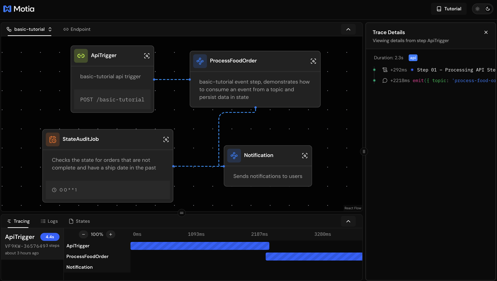
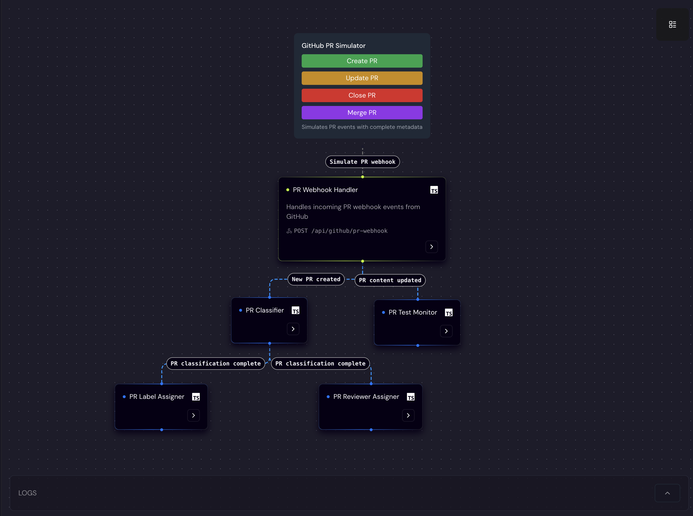

<a href="https://motia.dev">
  
</a>

<p align="center">
  <a href="https://trendshift.io/repositories/14032">
    
  </a>
</p>

<p align="center">
  <strong>🔥 A Modern Unified Backend Framework for APIs, background jobs, workflows, and Agents 🔥</strong>
</p>

<p align="center">
  <a href="https://www.npmjs.com/package/motia">
    
  </a>
  <a href="https://github.com/MotiaDev/motia/blob/main/LICENSE">
    
  </a>
  <a href="https://github.com/MotiaDev/motia">
    
  </a>
  <a href="https://twitter.com/motiadev" target="_blank">
    
  </a>
  <a href="https://discord.com/invite/nJFfsH5d6v" target="_blank">
    
  </a>
</p>
<p align="center">
  <a href="https://www.motia.dev/manifesto">💡 Motia Manifesto</a> •
  <a href="https://www.motia.dev/docs/getting-started/quick-start">🚀 Quick Start</a> •
  <a href="https://www.motia.dev/docs/concepts/steps/defining-steps">📋 Defining Steps</a> •
  <a href="https://motia.dev/docs">📚 Docs</a>
</p>

---

## 🎯 What is Motia?

Motia is a **modern backend framework** that unifies APIs, background jobs, workflows, and AI agents into a single cohesive system. Eliminate runtime complexity and build unified backends where **JavaScript, TypeScript, Python, etc**, work together in event-driven workflows, with built-in state management, observability, and one-click deployments.

Motia brings cohesion to the fragmented backend world with our core primitive: the **Step**.

[](https://motia.dev)

## 🚀 Quickstart

Get Motia project up and running in **under 60 seconds**:

### 1. Bootstrap a New Motia Project

```bash
npx motia@latest create -i   # runs the interactive terminal
```

Follow the prompts to pick a template, project name, and language.

### 2. Start the Workbench

Inside your new project folder, launch the dev server:

```bash
npx motia dev # ➜ http://localhost:3000
```

This spins up the Motia Workbench – a local UI for building, testing & observing your backend in real-time.


### 3. Hit Your First Endpoint

Open a new terminal tab and run:

```bash
curl http://localhost:3000/default
```

You should see the JSON response:

```json
{ "message": "Hello World from Motia!" }
```

### 4. Explore the Workbench UI


The Workbench is your command centre:

- **🌊 Flows** – Visualise how your Steps connect.
- **🔌 Endpoints** – Test APIs with one click and stream results live.
- **👁️ Traces** – Inspect end-to-end traces of every execution.
- **📊 Logs** – View structured logs grouped by trace.
- **🏪 State** – Inspect the key-value store across Steps.

---

🎉 **That's it!** You now have a fully-featured Motia project with:

- ✅ `/default` API endpoint
- ✅ Visual debugger & flow inspector
- ✅ Built-in observability
- ✅ Hot-reload for instant feedback

---

### 🧱 The Step Philosophy

- **🎯 Your Logic, Your Step**: A Step holds your business logic. It can be a simple function, a call to a database, or a complex AI agent. This is where your application's real work gets done.
- **🌍 Any Language, One Workflow**: Write Steps in TypeScript, Python, and other languages to come. all in the same project. Use Python for your AI agents and TypeScript for your API, and Motia makes them work together effortlessly.
- **⚡ Full Power, No Boilerplate**: Inside a Step's `handler`, you have the full power of the Node.js or Python ecosystem. Install any package, call any API, connect to any database. No restrictions, just your code.
- **👁️ Zero-Config Observability**: Get full end-to-end tracing and logging for every Step execution, automatically. No setup required. See exactly what happened, when, and why.
- **🌊 Simple & Powerful Workflows**: Connect Steps together by emitting and subscribing to events. Build complex, multi-stage processes with simple, declarative code.
- **🏪 Unified State**: Share data between Steps effortlessly. Motia provides built-in state management that is automatically traced, giving you a complete picture of your data's lifecycle through a workflow.

---

## 🚧 The Problem

Backend teams juggle **fragmented runtimes** across APIs, background queues, and AI agents. This creates deployment complexity, debugging gaps, and cognitive overhead from context-switching between frameworks.

**This fragmentation demands a unified system.**

---

## ✅ The Unified System

Motia unifies your entire backend into a **unified state**. APIs, background jobs, and AI agents become interconnected Steps with shared state and integrated observability.

| **Before**                  | **After (Motia)**                       |
| --------------------------- | --------------------------------------- |
| Multiple deployment targets | **Single unified deployment**           |
| Fragmented observability    | **End-to-end tracing**                  |
| Language dependent          | **JavaScript, TypeScript, Python, etc** |
| Context-switching overhead  | **Single intuitive model**              |
| Complex error handling      | **Automatic retries & fault tolerance** |

---

## 🔧 Supported Step Types

| Type        | Trigger               | Use Case                              |
| ----------- | --------------------- | ------------------------------------- |
| **`api`**   | HTTP Request          | Expose REST endpoints                 |
| **`event`** | Emitted Topics        | React to internal or external events  |
| **`cron`**  | Scheduled Time (cron) | Automate recurring jobs               |
| **`noop`**  | None                  | Placeholder for manual/external tasks |

---

### 🤔 How it Works

Motia's architecture is built around a single, powerful primitive: the **Step**. A Step is not just a trigger; it's a powerful container for your business logic. You can write anything from a simple database query to a complex AI agent interaction inside a single step. Instead of managing separate services for APIs, background workers, and scheduled tasks, you simply define how your steps are triggered.

- **Need a public API?** Create an `api` step. This defines a route and handler for HTTP requests. You can build a complete REST or GraphQL API just with these steps.
- **Need a background job or queue?** Have your `api` step `emit` an event. An `event` step subscribed to that event's topic will pick up the job and process it asynchronously. This is how you handle anything that shouldn't block the main request thread, from sending emails to complex data processing.
- **Need to run a task on a schedule?** Use a `cron` step. It will trigger automatically based on the schedule you define.

This model means you no longer need to glue together separate frameworks and tools. A single Motia application can replace a stack that might otherwise include **Nest.js** (for APIs), **Temporal** (for workflows), and **Celery/BullMQ** (for background jobs). It's all just steps and events.

## ⚡ Core Concepts

The **Step** is Motia's core primitive. The following concepts are deeply integrated with Steps to help you build powerful, complex, and scalable backends:

### 🔑 Steps & Step Types

Understand the three ways Steps are triggered:

- **HTTP (`api`)** – Build REST/GraphQL endpoints with zero boilerplate.
- **Events (`event`)** – React to internal or external events emitted by other steps.
- **Cron (`cron`)** – Schedule recurring jobs with a familiar cron syntax.

### 📣 Emit & Subscribe (Event-Driven Workflows)

Steps talk to each other by **emitting** and **subscribing** to topics. This decouples producers from consumers and lets you compose complex workflows with simple, declarative code.

### 🏪 State Management

All steps share a unified key-value state store. Every `get`, `set`, and `delete` is automatically traced so you always know when and where your data changed.

### 📊 Structured Logging

Motia provides structured, JSON logs correlated with trace IDs and step names. Search and filter your logs without regex hassle.

### 📡 Streams: Real-time Messaging

Push live updates from long-running or asynchronous workflows to clients without polling. Perfect for dashboards, progress indicators, and interactive AI agents.

### 👁️ End-to-End Observability with Traces

Every execution generates a full trace, capturing step timelines, state operations, emits, stream calls, and logs. Visualise everything in the Workbench's Traces UI and debug faster.

---

## 🗂 Examples

| [Finance Agent](https://github.com/MotiaDev/motia-examples/tree/main/examples/finance-agent) | [GitHub Agent](https://github.com/MotiaDev/motia-examples/tree/main/examples/github-integration-workflow) | [Gmail Manager](https://github.com/MotiaDev/motia-examples/tree/main/examples/gmail-workflow) |
| -------------------------------------------------------------------------------------------- | --------------------------------------------------------------------------------------------------------- | --------------------------------------------------------------------------------------------- |
|                           |                                       |                                 |

| [Trello Automation](https://github.com/MotiaDev/motia-examples/tree/main/examples/trello-flow) | [RAG Agent](https://github.com/MotiaDev/motia-examples/tree/main/examples/rag_example) | [AI Image Gen](https://github.com/MotiaDev/motia-examples/tree/main/examples/vision-example) |
| ---------------------------------------------------------------------------------------------- | -------------------------------------------------------------------------------------- | -------------------------------------------------------------------------------------------- |
|                                |                      |                           |

---

## 🌐 Language Support

Write steps in your preferred language:

| Language       | Status         | Example           |
| -------------- | -------------- | ----------------- |
| **JavaScript** | ✅ Stable      | `handler.step.js` |
| **TypeScript** | ✅ Stable      | `handler.step.ts` |
| **Python**     | ✅ Stable      | `handler.step.py` |
| **Ruby**       | 🚧 Beta        | `handler.step.rb` |
| **Go**         | 🔄 Coming Soon | `handler.step.go` |
| **Rust**       | 🔄 Coming Soon | `handler.step.rs` |

---

### 💬 **Get Help**

- **📋 Questions**: Use our [Discord community](https://discord.gg/7rXsekMK)
- **🐛 Bug Reports**: [GitHub Issues](https://github.com/MotiaDev/motia/issues)
- **📖 Documentation**: [Official Docs](https://motia.dev/docs)
- **🎥 Blog**: [Motia Blog](https://dev.to/motiadev)

### 🤝 **Contributing**

We welcome contributions! Whether it's:

- 🐛 Bug fixes and improvements
- ✨ New features and step types
- 📚 Documentation and examples
- 🌍 Language support additions
- 🎨 Workbench UI enhancements

Check out our [Contributing Guide](https://github.com/MotiaDev/motia/blob/main/CONTRIBUTING.md) to get started.

---

<div align="center">

**🌟 Ready to unify your backend?**

[🚀 **Get Started Now**](https://motia.dev) • [📖 **Read the Docs**](https://motia.dev/docs) • [💬 **Join Discord**](https://discord.com/invite/nJFfsH5d6v)

</div>

---

<div align="center">

[](https://www.star-history.com/#motiadev/motia&Date)

<sub>Built with ❤️ by the Motia team • **Star us if you find [Motia](https://github.com/orgs/MotiaDev/motia) useful!** ⭐</sub>

</div>

### 🚧 Roadmap

We have a public roadmap for Motia, you can view it [here](https://github.com/orgs/MotiaDev/projects/2/views/4).

Feel free to add comments to the issues, or create a new issue if you have a feature request.

| Feature                               | Status  | Link                                                 | Description                            |
| ------------------------------------- | ------- | ---------------------------------------------------- | -------------------------------------- |
| Python Types                          | Planned | [#485](https://github.com/MotiaDev/motia/issues/485) | Add support for Python types           |
| Streams: RBAC                         | Planned | [#495](https://github.com/MotiaDev/motia/issues/495) | Add support for RBAC                   |
| Streams: Workbench UI                 | Planned | [#497](https://github.com/MotiaDev/motia/issues/497) | Add support for Workbench UI           |
| Queue Strategies                      | Planned | [#476](https://github.com/MotiaDev/motia/issues/476) | Add support for Queue Strategies       |
| Reactive Steps                        | Planned | [#477](https://github.com/MotiaDev/motia/issues/477) | Add support for Reactive Steps         |
| Allow cloud configuration             | Planned | [#478](https://github.com/MotiaDev/motia/issues/478) | Add support for cloud configuration    |
| BYOC: Bring your own Cloud: AWS       | Planned | [#479](https://github.com/MotiaDev/motia/issues/479) | Add support for AWS                    |
| Point in time triggers                | Planned | [#480](https://github.com/MotiaDev/motia/issues/480) | Add support for Point in time triggers |
| Workbench plugins                     | Planned | [#481](https://github.com/MotiaDev/motia/issues/481) | Add support for Workbench plugins      |
| Rewrite our Core in either Go or Rust | Planned | [#482](https://github.com/MotiaDev/motia/issues/482) | Rewrite our Core in either Go or Rust  |
| Decrease deployment time              | Planned | [#483](https://github.com/MotiaDev/motia/issues/483) | Decrease deployment time               |
| Built-in database support             | Planned | [#484](https://github.com/MotiaDev/motia/issues/484) | Add support for built-in database      |
| BYOC: Google Cloud Platform           | Planned | [#486](https://github.com/MotiaDev/motia/issues/486) | Add support for Google Cloud Platform  |
| BYOC: Microsoft Azure                 | Planned | [#487](https://github.com/MotiaDev/motia/issues/487) | Add support for Microsoft Azure        |
| BYOC: Vercel                          | Planned | [#488](https://github.com/MotiaDev/motia/issues/488) | Add support for Vercel                 |
| BYOC: Cloudflare                      | Planned | [#489](https://github.com/MotiaDev/motia/issues/489) | Add support for Cloudflare             |
| New languages: Go                     | Planned | [#490](https://github.com/MotiaDev/motia/issues/490) | Add support for Go                     |
| New languages: Rust                   | Planned | [#491](https://github.com/MotiaDev/motia/issues/491) | Add support for Rust                   |
| New languages: Java                   | Planned | [#492](https://github.com/MotiaDev/motia/issues/492) | Add support for Java                   |
| New languages: Ruby                   | Planned | [#493](https://github.com/MotiaDev/motia/issues/493) | Add support for Ruby                   |
| New languages: C#                     | Planned | [#494](https://github.com/MotiaDev/motia/issues/494) | Add support for C#                     |
| BYOC: Kubernetes                      | Planned | [#496](https://github.com/MotiaDev/motia/issues/496) | Add support for Kubernetes             |