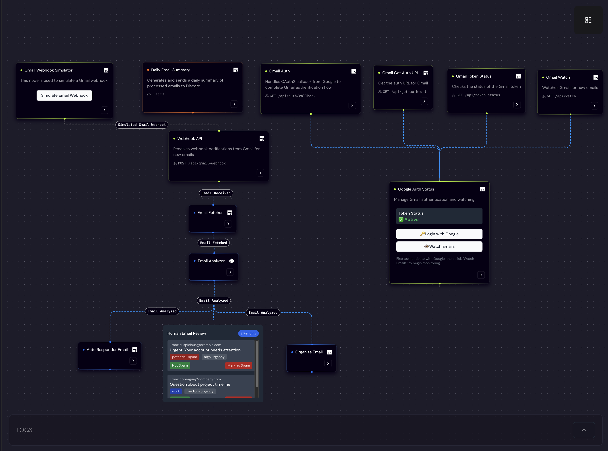
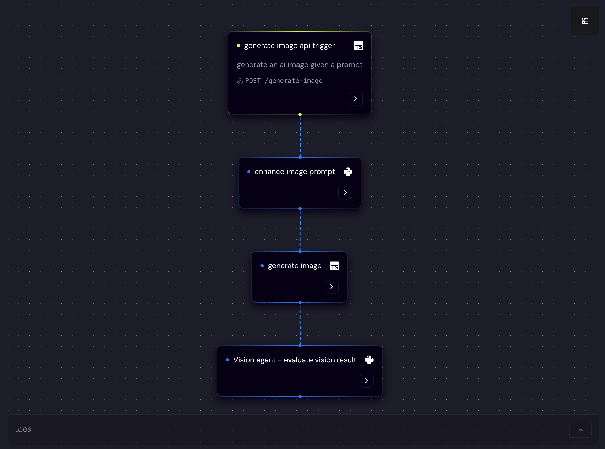

<a name="readme-top"></a>

<div align="center">
  
  <h1 align="center"> Unified Backend for APIs, Queues, Events, and Agents </h1>
</div>

<div align="center">
  <a href="https://motia.dev"></a>
  <a href="https://discord.gg/nJFfsH5d6v"></a>
  <a href="https://motia.dev/docs"></a>
  <a href="https://www.npmjs.com/package/motia"></a>
  <a href="https://www.npmjs.com/package/motia"></a>
  <a href="#"></a>
  <hr>
</div>

---

Motia is a modern backend framework that combines APIs, background jobs, event systems, and AI agents into one unified, observable runtime. Stop context-switching between multiple runtimes—build your entire backend with event-driven steps, mixing JavaScript, TypeScript, and Python freely, while keeping shared state, tracing, and deployment simplicity.

---

## 🚧 The Problem: Fragmented Runtimes

Backend engineering teams often juggle multiple fragmented runtimes:

| Runtime Layer            | Common Tools                                                        |
| ------------------------ | ------------------------------------------------------------------- |
| 🖥️ **API Servers**       | Express, FastAPI, Rails, Django, Laravel, Spring, .NET, Flask, Nest |
| 📬 **Job Queues/Events** | Sidekiq, Temporal, BullMQ, Kafka, RabbitMQ, AWS SQS, Redis Streams  |
| 🤖 **AI & Agents**       | LangGraph, CrewAI, Mastra, LangChain, AutoGPT, Agnu, AgentGPT       |

**Common issues caused by fragmentation:**

- **Deployment Complexity:** Multiple scaling models and deployment targets
- **Debugging Difficulty:** Fragmented observability, incomplete traces
- **Developer Constraints:** Language lock-in, limited flexibility
- **Cognitive Overhead:** Context-switching across frameworks
- **Redundant Boilerplate:** Duplicated logic and complex code-sharing

---

## ✅ Motia’s Unified Solution

Motia solves this fragmentation by unifying your backend into a single runtime:

| Runtime Layer            | Motia's Approach                                                |
| ------------------------ | --------------------------------------------------------------- |
| 🖥️ **API Servers**       | ✅ Expose workflow steps instantly as APIs/webhooks             |
| 📬 **Job Queues/Events** | ✅ Unified runtime with built-in queuing, retries, and state    |
| 🤖 **AI & Agents**       | ✅ Seamlessly combine deterministic logic & AI-driven workflows |

**Benefits of Unifying with Motia:**

- 🎯 **Unified Deployment:** Single consistent scaling model
- 🔍 **Enhanced Observability:** Simplified end-to-end tracing
- ⚙️ **Full Language Flexibility:** JavaScript, TypeScript, Python
- 🧠 **Lower Cognitive Load:** Single intuitive backend model
- ♻️ **Simplified Error Handling:** Automatic retries & error management

---

## 🎯 Key Motia Features

Motia is engineered to scale seamlessly from early prototypes into robust, maintainable systems, providing a structured foundation for building reliable, production-ready applications.

| Features                             | Description                                                                                                                                                                                                                                       |
| ------------------------------------ | ------------------------------------------------------------------------------------------------------------------------------------------------------------------------------------------------------------------------------------------------- |
| 📦 **Full PyPi & NPM Support**       | Seamlessly integrate and leverage packages from the vast ecosystems of PyPi and NPM in your workflows.                                                                                                                                            |
| 🚏 **Built-in Routing**              | Motia provides out-of-the-box routing capabilities, allowing instant setup of APIs and webhooks with no additional configuration required.                                                                                                        |
| 🧪 **Fully Testable**                | Integrates effortlessly with your existing test suite, enabling comprehensive testing of workflows and steps using your preferred testing tools.                                                                                                  |
| 👤 **Human-in-the-Loop**             | Built-in mechanisms for human intervention, making it easy to integrate review or approval steps directly into automated workflows.                                                                                                               |
| 📜 **Minimal DSL**                   | Motia uses a minimal and intuitive domain-specific language (DSL), reducing learning curves and enabling quicker adoption.                                                                                                                        |
| 🚀 **API Steps (APIs/Webhooks)**     | Quickly expose workflow steps as APIs or webhooks without additional server setup, ideal for integrating into existing web infrastructure.                                                                                                        |
| 🖥️ **Motia Workbench**               | Provides a visual interface for workflow management, debugging, and monitoring, allowing easy visualization and manipulation of workflow execution.                                                                                               |
| 🔎 **Trace IDs & Logging**           | Integrated trace IDs and structured logging enable end-to-end observability, simplifying debugging and improving reliability.                                                                                                                     |
| 🔄 **Middleware & CLI**              | Easily extend workflow capabilities with middleware, and rapidly create, manage, and deploy projects through a powerful CLI tool.                                                                                                                 |
| ⚡ **Hot-Reloading**                 | Real-time development experience allowing you to instantly see changes without restarting your workflows, significantly speeding up the development cycle.                                                                                        |
| 📊 **Mermaid Diagrams**              | Automatic generation of Mermaid diagrams for each workflow, offering clear visualization of flow logic and dependencies.                                                                                                                          |
| 🌐 **Motia Cursor & IDE Extensions** | Enhance productivity with Motia-specific rules in Cursor and VS-Code extensions, integrating workflow management directly into your preferred IDE environment.                                                                                    |
| ☁️ **Motia Cloud**                   | One-command deployments, integrated observability tools, centralized logging, secret management, and environment-specific configurations including canary and rollback deployments, enabling robust and reliable workflow hosting and management. |

## 🗂 Examples

| [Finance Agent](https://github.com/MotiaDev/motia-examples/tree/main/examples/finance-agent) | [GitHub Agent](https://github.com/MotiaDev/motia-examples/tree/main/examples/github-integration-workflow) | [Gmail Manager](https://github.com/MotiaDev/motia-examples/tree/main/examples/gmail-workflow) |
| -------------------------------------------------------------------------------------------- | --------------------------------------------------------------------------------------------------------- | --------------------------------------------------------------------------------------------- |
| <br>Financial insights                          | <br>PR automation                                      | <br>Email automation                                  |

| [Trello Automation](https://github.com/MotiaDev/motia-examples/tree/main/examples/trello-flow) | [RAG Agent](https://github.com/MotiaDev/motia-examples/tree/main/examples/rag_example) | [AI Image Gen](https://github.com/MotiaDev/motia-examples/tree/main/examples/vision-example) |
| ---------------------------------------------------------------------------------------------- | -------------------------------------------------------------------------------------- | -------------------------------------------------------------------------------------------- |
| <br>Task automation                               | <br>Knowledge retrieval                     | <br>Generate images                           |

---

## 🚀 Quick Start

Get your first Motia workflow running in minutes:

**1. Create a Project**

Create a new project with the Motia CLI:

```bash
npx motia create -n my-first-agent
```

_This sets up a starter project in the `my-first-agent` folder._

**2. Launch the Dev Server**

Navigate into your project and start the server:

```bash
cd my-first-agent
pnpm run dev
```

**3. Open the Workbench**

Open [http://localhost:3000](http://localhost:3000) to see your workflow visualized in the Motia Workbench.

**4. Trigger Your Workflow**

Trigger your API Step:

```bash
curl -X POST http://localhost:3000/default -H "Content-Type: application/json" -d '{}'
```

Trigger your Event Step (directly):

```bash
npx motia emit --topic test-state --message '{}'
```

🎉 **That's it!** You're ready to build with Motia.

## Start building your APIs, agents and automations with simple steps

- Configure a simple to emit/subscribe, assign to a flow and inculde runtime validation
- Define a function to handle when the step is triggered
- Import any package

```TypeScript
import { OpenAI } from 'openai';
import { z } from 'zod';
import type { EventConfig, StepHandler } from 'motia';

const openai = new OpenAI({
    apiKey: process.env.OPENAI_API_KEY,
});

export const config: EventConfig = {
  type: 'event',
  name: 'Auto-Reply to Support Emails',
  subscribes: ['email.received'],
  emits: ['email.send'],
  flows: ['email-support'],
  input: z.object({ subject: z.string(), body: z.string(), from: z.string() }),
};

export const handler: StepHandler<typeof config> = async (inputData, context) => {
  const { subject, body, from } = inputData;
  const { emit, logger } = context;

  const sentimentResponse = await openai.chat.completions.create({
    model: "gpt-4o",
    messages: [{ role: "user", content: `Analyze the sentiment of the following text: ${body}` }],
  });

  const sentiment = sentimentResponse.choices[0].message.content;

  logger.info('[EmailAutoReply] Sentiment analysis', { sentiment });

  emit({
    type: 'email.send',
    data: { from, subject, body, sentiment },
  });
};
```

## Next Steps

- **Dive into the Documentation:** Explore the [full Motia documentation](https://motia.dev/docs) to understand core concepts, step types, state management, and more.
- **Explore Examples:** Check out practical [examples](https://motia.dev/docs/real-world-use-cases) to see Motia in action and get inspiration for your own workflows and agents.
- **Join the Community:** Connect with other Motia users and the development team on our [Discord server](https://discord.gg/nJFfsH5d6v) and contribute to the project on [GitHub](https://github.com/MotiaDev/motia).

**License:** [MIT](LICENSE)
