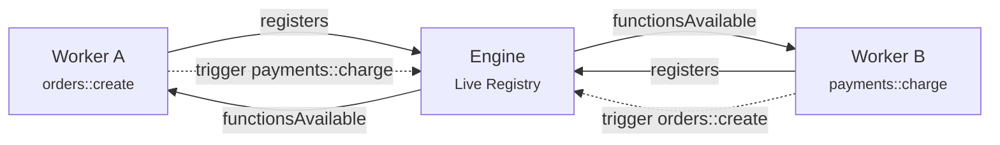

When a worker connects to the engine, it receives the full list of functions registered across every other worker. When a new worker connects and registers functions, every existing worker gets notified. When a worker disconnects, its functions disappear and everyone is notified again.

No configuration files. No service registries. No hardcoded URLs. The engine maintains a live registry and pushes changes to every connected worker in real time.

## Why This Matters

In traditional distributed systems, services need to know where other services live. This knowledge typically comes from one of several places:

- **Configuration files** — hardcoded URLs or hostnames that must be updated and redeployed whenever services move
- **DNS-based discovery** — services register with DNS and others look them up, but DNS caching creates propagation delays
- **Service registries** — dedicated infrastructure (Consul, etcd, ZooKeeper) that services poll for changes
- **Service meshes** — sidecar proxies that handle routing, adding operational complexity and latency
- **Client libraries** — SDKs that embed service locations, requiring library updates when topology changes

Each approach trades off complexity, latency, and operational burden. Most require explicit registration, health checking, and some form of polling or TTL-based invalidation.

iii takes a different approach: the engine itself is the registry, and it pushes changes to workers rather than waiting for them to poll.

## How Discovery Works

When a worker connects, it registers its functions with the engine. The engine immediately broadcasts the updated function list to every connected worker. When a worker disconnects — whether gracefully or due to failure — its functions are removed and the change propagates instantly.

This is push-based discovery. Workers don't poll. They don't cache with TTLs. They receive a stream of updates and always have a current view of the system.

The difference matters at scale. In a polling-based system, there's always a window where a service might call a function that no longer exists, or miss a function that just became available. With push-based discovery, that window shrinks to the propagation time of a single message.

## What This Enables

Traditional architectures require coordination when the system topology changes. Adding a new service means updating every service that needs to call it — changing config files, updating client libraries, or waiting for DNS to propagate.

With iii, topology changes are automatic:

- **Scale workers independently** — spin up more instances of a worker and the engine load-balances across them
- **Deploy new capabilities** — connect a new worker with new functions and they're immediately available to the entire system
- **Remove services cleanly** — disconnect a worker and its functions disappear from the registry, no stale references

The engine also exposes built-in functions through its modules (like `enqueue`, `state::set`, `stream::set`). These are always available and documented in the [Modules](/docs/modules) section. But the distinctive behavior of Discovery is the dynamic part — your workers forming a living system that adapts as it runs.

Workers can subscribe to discovery events or query the registry directly. See the [SDK Reference](/docs/api-reference/iii-sdk) for the specific APIs.

<Cards>
  <Card icon={<Code />} title="Function & Trigger" href="/docs/concepts/function-and-trigger">
    How Functions are registered and triggered across workers and languages.
  </Card>
  <Card icon={<FileText />} title="SDK Reference" href="/docs/api-reference/iii-sdk">
    Full API reference for listFunctions, listWorkers, and onFunctionsAvailable.
  </Card>
  <Card icon={<Settings />} title="Modules" href="/docs/modules">
    Details on each built-in function: State, Queue, Stream, and more.
  </Card>
</Cards>
