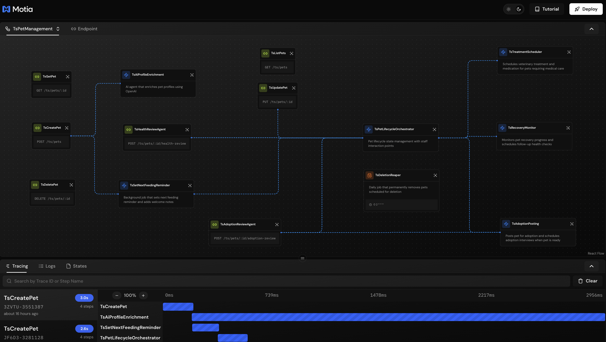
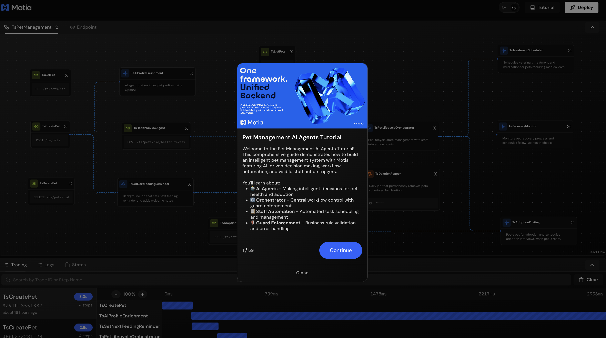
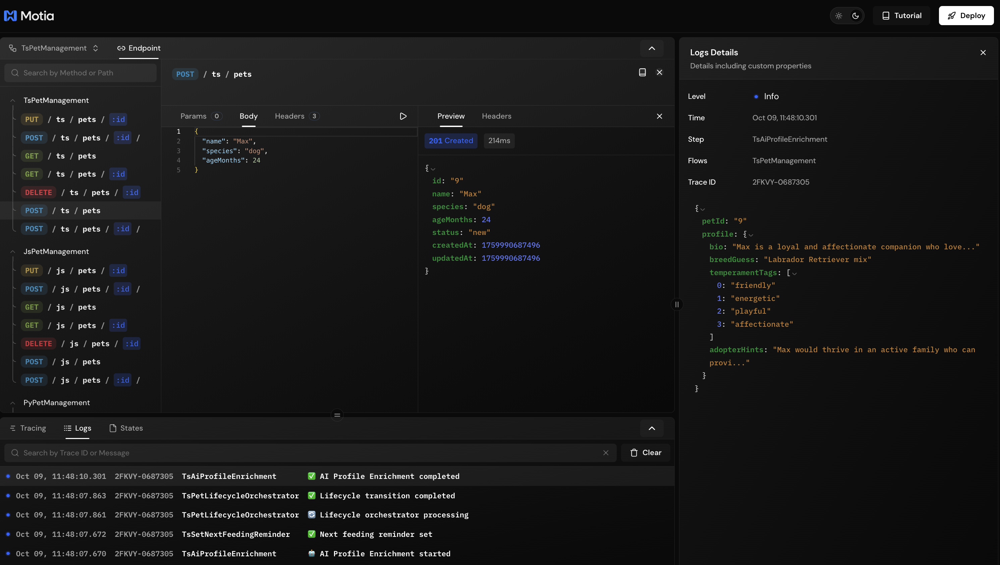
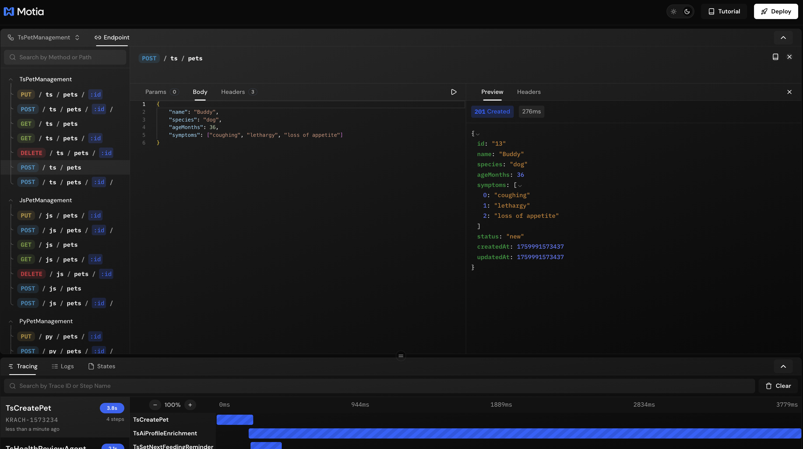
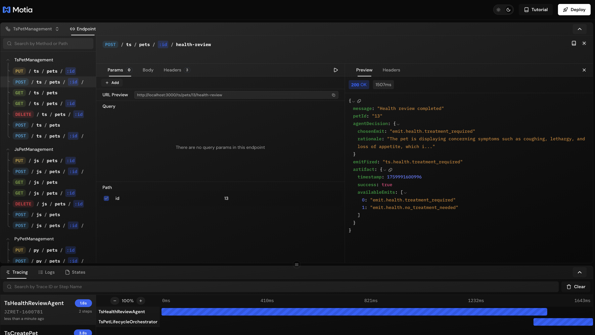
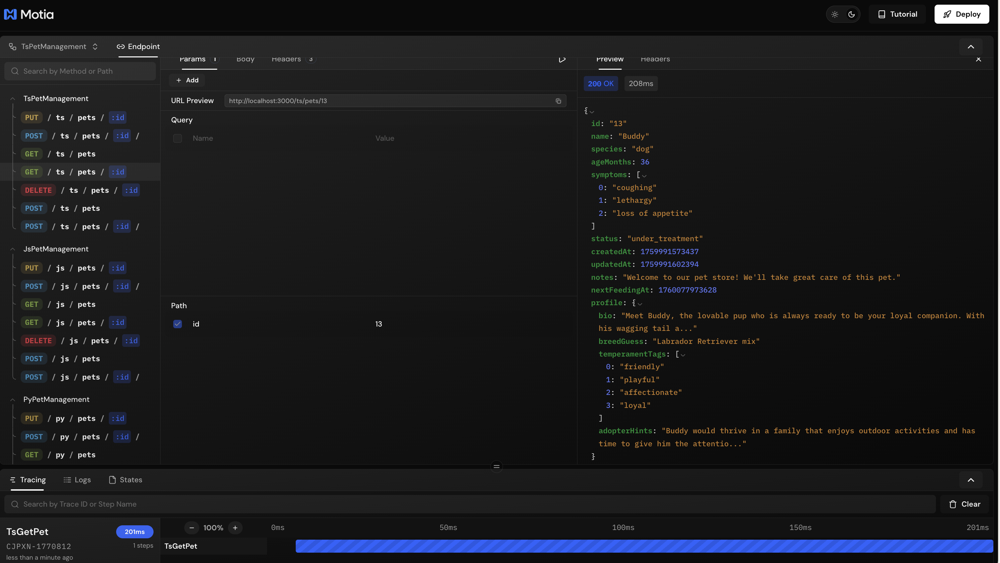

## What You'll Build

An intelligent pet management system with AI agents that automate decisions and enrich data:

- **AI Profile Enrichment** - Automatically generates detailed pet profiles using AI
- **AI Health Review Agent** - Makes intelligent health decisions based on symptoms
- **AI Adoption Review Agent** - Assesses adoption readiness and data completeness
- **Orchestrator Integration** - AI decisions that drive real workflow changes


---

## Getting Started

Clone the example repository:

```bash
git clone https://github.com/MotiaDev/build-your-first-app.git
cd build-your-first-app
git checkout ai-agents
```

Install dependencies:

```bash
npm install
```

Set up your OpenAI API key in `.env`:

```bash
OPENAI_API_KEY=your_api_key_here
```

<Callout type="warning">
**Important!** This tutorial requires an OpenAI API key. Get yours at [platform.openai.com/api-keys](https://platform.openai.com/api-keys). Without it, the AI agents won't work.
</Callout>

Start the Workbench:

```bash
npm run dev
```

Your Workbench will be available at `http://localhost:3000`.

---

## Project Structure

<Folder name="my-pet-api" defaultOpen>
  <Folder name="steps" defaultOpen>
    <Folder name="typescript">
      <File name="create-pet.step.ts" />
      <File name="ai-profile-enrichment.step.ts" />
      <File name="health-review-agent.step.ts" />
      <File name="adoption-review-agent.step.ts" />
      <File name="pet-lifecycle-orchestrator.step.ts" />
      <File name="agent-decision-framework.ts" />
      <File name="ts-store.ts" />
    </Folder>
    <Folder name="javascript">
      <File name="create-pet.step.js" />
      <File name="ai-profile-enrichment.step.js" />
      <File name="health-review-agent.step.js" />
      <File name="adoption-review-agent.step.js" />
      <File name="pet-lifecycle-orchestrator.step.js" />
      <File name="agent-decision-framework.js" />
      <File name="js-store.js" />
    </Folder>
    <Folder name="python">
      <File name="create_pet_step.py" />
      <File name="ai_profile_enrichment_step.py" />
      <File name="health_review_agent_step.py" />
      <File name="adoption_review_agent_step.py" />
      <File name="pet_lifecycle_orchestrator_step.py" />
    </Folder>
  </Folder>
  <Folder name="services">
    <File name="pet_store.py" />
    <File name="types.py" />
  </Folder>
  <File name=".env" />
  <File name="package.json" />
  <File name="requirements.txt" />
  <File name="types.d.ts" />
</Folder>

<Callout type="info">
Files like `features.json` and `tutorial.tsx` are only for the interactive tutorial and are not part of Motia's project structure.
</Callout>

All code examples in this guide are available in the [build-your-first-app](https://github.com/MotiaDev/build-your-first-app/tree/ai-agents) repository.

You can follow this guide to learn how to build AI agents with Motia step by step, or you can clone the repository and dive into our Interactive Tutorial to learn by doing directly in the Workbench.



---

## Understanding AI Agents

You've built APIs, background jobs, and workflows that orchestrate your pet shelter. But what about decisions that aren't black and white? Should this pet's symptoms require treatment? Is this profile ready for the adoption page?

That's where AI agents come in. They're smart assistants that make judgment calls based on context - the kind of decisions that would normally need a human to review every single case.

In our pet shelter, we use two flavors:
- **Content generators** write engaging pet profiles automatically
- **Decision makers** evaluate health symptoms and choose whether treatment is needed
- **Data reviewers** assess if adoption information is complete

The difference from traditional code? Instead of writing hundreds of if-else rules for every possible symptom combination, you describe what matters to the AI. It reads the context and makes an informed call.

When a pet arrives with "coughing, lethargy, loss of appetite" - the AI evaluates these symptoms together and decides if treatment is needed. No hardcoded rules. Just intelligent analysis of the situation.

---

## Creating Your First AI Agent

Let's start with a content generation agent that automatically enriches pet profiles when they're created.

### Step 1: Set Up Pet Creation to Emit Events

First, update your pet creation endpoint to emit events that will trigger the AI agent.

<Callout type="info">
View on GitHub:
- [TypeScript](https://github.com/MotiaDev/build-your-first-app/blob/ai-agents/steps/typescript/create-pet.step.ts)
- [Python](https://github.com/MotiaDev/build-your-first-app/blob/ai-agents/steps/python/create_pet_step.py)
- [JavaScript](https://github.com/MotiaDev/build-your-first-app/blob/ai-agents/steps/javascript/create-pet.step.js)
</Callout>

<Tabs items={['TypeScript', 'Python', 'JavaScript']}>
  <Tab value="TypeScript">
    ```typescript title="steps/typescript/create-pet.step.ts"
    import { ApiRouteConfig, Handlers } from 'motia'
    import { z } from 'zod'
    import { TSStore } from './ts-store'

    const createPetSchema = z.object({
      name: z.string().min(1, 'Name is required'),
      species: z.enum(['dog', 'cat', 'bird', 'other']),
      ageMonths: z.number().int().min(0),
    })

    export const config: ApiRouteConfig = {
      name: 'TsCreatePet',
      type: 'api',
      path: '/ts/pets',
      method: 'POST',
      bodySchema: createPetSchema,
      // Declare the event this endpoint emits
      emits: ['ts.pet.created'],
      flows: ['TsPetManagement'],
    }

    export const handler: Handlers['TsCreatePet'] = async (req, { emit, logger }) => {
      const data = createPetSchema.parse(req.body)
      const pet = TSStore.create(data)

      logger.info('Pet created', { petId: pet.id })

      // Emit event to trigger AI enrichment
      await emit({
        topic: 'ts.pet.created',
        data: {
          petId: pet.id,
          name: pet.name,
          species: pet.species,
          ageMonths: pet.ageMonths
        }
      })

      return { status: 201, body: pet }
    }
    ```
  </Tab>
  <Tab value="Python">
    ```python title="steps/python/create_pet_step.py"
    import sys
    import os
    import time
    sys.path.insert(0, os.path.join(os.path.dirname(__file__), '..', '..'))
    from services import pet_store

    config = {
        "name": "PyCreatePet",
        "type": "api",
        "path": "/py/pets",
        "method": "POST",
        "emits": ["py.pet.created"],
        "flows": ["PyPetManagement"]
    }

    async def handler(req, ctx=None):
        b = req.get("body") or {}
        name = b.get("name")
        species = b.get("species")
        age = b.get("ageMonths")

        if not isinstance(name, str) or not name.strip():
            return {"status": 400, "body": {"message": "Invalid name"}}
        if species not in ["dog", "cat", "bird", "other"]:
            return {"status": 400, "body": {"message": "Invalid species"}}

        try:
            age_val = int(age)
        except Exception:
            return {"status": 400, "body": {"message": "Invalid ageMonths"}}

        pet = pet_store.create(name, species, age_val)
        
        # Emit event to trigger AI enrichment
        if ctx and ctx.emit:
            await ctx.emit({
                "topic": "py.pet.created",
                "data": {
                    "petId": pet["id"],
                    "name": pet["name"],
                    "species": pet["species"],
                    "ageMonths": pet["ageMonths"]
                }
            })

        return {"status": 201, "body": pet}
    ```
  </Tab>
  <Tab value="JavaScript">
    ```javascript title="steps/javascript/create-pet.step.js"
    const { create } = require('./js-store')

    const config = {
      name: 'JsCreatePet',
      type: 'api',
      path: '/js/pets',
      method: 'POST',
      emits: ['js.pet.created'],
      flows: ['JsPetManagement']
    }

    const handler = async (req, { emit }) => {
      const b = req.body || {}
      const name = typeof b.name === 'string' && b.name.trim()
      const speciesOk = ['dog', 'cat', 'bird', 'other'].includes(b.species)
      const ageOk = Number.isFinite(b.ageMonths)

      if (!name || !speciesOk || !ageOk) {
        return { status: 400, body: { message: 'Invalid payload' } }
      }

      const pet = create({ name, species: b.species, ageMonths: Number(b.ageMonths) })

      // Emit event to trigger AI enrichment
      if (emit) {
        await emit({
          topic: 'js.pet.created',
          data: {
            petId: pet.id,
            name: pet.name,
            species: pet.species,
            ageMonths: pet.ageMonths
          }
        })
      }

      return { status: 201, body: pet }
    }

    module.exports = { config, handler }
    ```
  </Tab>
</Tabs>

The API endpoint now emits an event after creating a pet. The response returns immediately while the AI agent processes asynchronously in the background.

---

### Step 2: Create the AI Profile Enrichment Agent

Now let's create the AI agent that listens for new pets and enriches their profiles with AI-generated content.

<Callout type="info">
View on GitHub:
- [TypeScript](https://github.com/MotiaDev/build-your-first-app/blob/ai-agents/steps/typescript/ai-profile-enrichment.step.ts)
- [Python](https://github.com/MotiaDev/build-your-first-app/blob/ai-agents/steps/python/ai_profile_enrichment_step.py)
- [JavaScript](https://github.com/MotiaDev/build-your-first-app/blob/ai-agents/steps/javascript/ai-profile-enrichment.step.js)
</Callout>

<Tabs items={['TypeScript', 'Python', 'JavaScript']}>
  <Tab value="TypeScript">
    ```typescript title="steps/typescript/ai-profile-enrichment.step.ts"
    import { TSStore } from './ts-store'

    export const config = {
      type: 'event',
      name: 'TsAiProfileEnrichment',
      description: 'AI agent that enriches pet profiles with generated content',
      subscribes: ['ts.pet.created'],
      emits: [],
      flows: ['TsPetManagement']
    }

    export const handler = async (input: any, context?: any) => {
      const { emit, logger } = context || {}
      const { petId, name, species, ageMonths } = input

      if (logger) {
        logger.info('AI Profile Enrichment started', { petId })
      }

      // Check for API key
      const apiKey = process.env.OPENAI_API_KEY
      if (!apiKey) {
        if (logger) {
          logger.warn('OpenAI API key not found, skipping enrichment', { petId })
        }
        return
      }

      try {
        const pet = TSStore.get(petId)
        if (!pet) {
          if (logger) {
            logger.error('Pet not found for enrichment', { petId })
          }
          return
        }

        // Build the AI prompt
        const prompt = `You are a pet adoption specialist writing engaging profiles for potential adopters.

Pet Details:
- Name: ${name}
- Species: ${species}
- Age: ${ageMonths} months old

Generate a warm, adoption-focused profile in JSON format with these fields:
{
  "bio": "A warm, engaging 2-3 sentence description for potential adopters",
  "breedGuess": "Your best guess at the breed or mix (be creative but reasonable)",
  "temperamentTags": ["array", "of", "3-5", "personality", "traits"],
  "adopterHints": "Practical advice for potential adopters in 1-2 sentences"
}

Make it heartwarming and highlight what makes this pet special!`

        // Call OpenAI API
        const response = await fetch('https://api.openai.com/v1/chat/completions', {
          method: 'POST',
          headers: {
            'Content-Type': 'application/json',
            'Authorization': `Bearer ${apiKey}`
          },
          body: JSON.stringify({
            model: 'gpt-3.5-turbo',
            messages: [{ role: 'user', content: prompt }],
            temperature: 0.7,
            max_tokens: 500
          })
        })

        if (!response.ok) {
          throw new Error(`OpenAI API error: ${response.statusText}`)
        }

        const result = await response.json()
        const content = result.choices?.[0]?.message?.content

        if (!content) {
          throw new Error('No content in OpenAI response')
        }

        // Parse the AI-generated profile
        const aiProfile = JSON.parse(content)

        // Update pet with enriched profile
        const enrichedPet = TSStore.update(petId, {
          bio: aiProfile.bio,
          breedGuess: aiProfile.breedGuess,
          temperamentTags: aiProfile.temperamentTags,
          adopterHints: aiProfile.adopterHints
        })

        if (logger) {
          logger.info('AI Profile Enrichment completed', {
            petId,
            bio: aiProfile.bio?.substring(0, 50) + '...',
            breedGuess: aiProfile.breedGuess
          })
        }

      } catch (error: any) {
        if (logger) {
          logger.error('AI Profile Enrichment error', { 
            petId, 
            error: error.message 
          })
        }

        // Fallback: Create basic profile if AI fails
        TSStore.update(petId, {
          bio: `Meet ${name}, a wonderful ${species} looking for a loving home!`,
          breedGuess: 'Mixed breed',
          temperamentTags: ['friendly', 'lovable'],
          adopterHints: 'Perfect for families who love pets!'
        })

        if (logger) {
          logger.info('Applied fallback profile', { petId })
        }
      }
    }
    ```
  </Tab>
  <Tab value="Python">
    ```python title="steps/python/ai_profile_enrichment_step.py"
    import sys
    import os
    import json
    sys.path.insert(0, os.path.join(os.path.dirname(__file__), '..', '..'))
    from services import pet_store
    import httpx

    config = {
        "type": "event",
        "name": "PyAiProfileEnrichment",
        "description": "AI agent that enriches pet profiles with generated content",
        "subscribes": ["py.pet.created"],
        "emits": [],
        "flows": ["PyPetManagement"]
    }

    async def handler(input_data, ctx=None):
        logger = getattr(ctx, 'logger', None) if ctx else None
        
        pet_id = input_data.get("petId")
        name = input_data.get("name")
        species = input_data.get("species")
        age_months = input_data.get("ageMonths")

        if logger:
            logger.info("AI Profile Enrichment started", {"petId": pet_id})

        # Check for API key
        api_key = os.environ.get("OPENAI_API_KEY")
        if not api_key:
            if logger:
                logger.warn("OpenAI API key not found, skipping enrichment", {"petId": pet_id})
            return

        try:
            pet = pet_store.get(pet_id)
            if not pet:
                if logger:
                    logger.error("Pet not found for enrichment", {"petId": pet_id})
                return

            # Build the AI prompt
            prompt = f"""You are a pet adoption specialist writing engaging profiles for potential adopters.

Pet Details:
- Name: {name}
- Species: {species}
- Age: {age_months} months old

Generate a warm, adoption-focused profile in JSON format with these fields:
{{
  "bio": "A warm, engaging 2-3 sentence description for potential adopters",
  "breedGuess": "Your best guess at the breed or mix (be creative but reasonable)",
  "temperamentTags": ["array", "of", "3-5", "personality", "traits"],
  "adopterHints": "Practical advice for potential adopters in 1-2 sentences"
}}

Make it heartwarming and highlight what makes this pet special!"""

            # Call OpenAI API
            async with httpx.AsyncClient() as client:
                response = await client.post(
                    'https://api.openai.com/v1/chat/completions',
                    headers={
                        'Content-Type': 'application/json',
                        'Authorization': f'Bearer {api_key}'
                    },
                    json={
                        'model': 'gpt-3.5-turbo',
                        'messages': [{'role': 'user', 'content': prompt}],
                        'temperature': 0.7,
                        'max_tokens': 500
                    },
                    timeout=30.0
                )

            if response.status_code != 200:
                raise Exception(f"OpenAI API error: {response.status_code}")

            result = response.json()
            content = result.get('choices', [{}])[0].get('message', {}).get('content')

            if not content:
                raise Exception('No content in OpenAI response')

            # Parse the AI-generated profile
            ai_profile = json.loads(content)

            # Update pet with enriched profile
            enriched_pet = pet_store.update(pet_id, {
                "bio": ai_profile.get("bio"),
                "breedGuess": ai_profile.get("breedGuess"),
                "temperamentTags": ai_profile.get("temperamentTags"),
                "adopterHints": ai_profile.get("adopterHints")
            })

            if logger:
                logger.info("AI Profile Enrichment completed", {
                    "petId": pet_id,
                    "bio": ai_profile.get("bio", "")[:50] + "...",
                    "breedGuess": ai_profile.get("breedGuess")
                })

        except Exception as error:
            if logger:
                logger.error("AI Profile Enrichment error", {
                    "petId": pet_id,
                    "error": str(error)
                })

            # Fallback: Create basic profile if AI fails
            pet_store.update(pet_id, {
                "bio": f"Meet {name}, a wonderful {species} looking for a loving home!",
                "breedGuess": "Mixed breed",
                "temperamentTags": ["friendly", "lovable"],
                "adopterHints": "Perfect for families who love pets!"
            })

            if logger:
                logger.info("Applied fallback profile", {"petId": pet_id})
    ```
  </Tab>
  <Tab value="JavaScript">
    ```javascript title="steps/javascript/ai-profile-enrichment.step.js"
    const { get, update } = require('./js-store')

    const config = {
      type: 'event',
      name: 'JsAiProfileEnrichment',
      description: 'AI agent that enriches pet profiles with generated content',
      subscribes: ['js.pet.created'],
      emits: [],
      flows: ['JsPetManagement']
    }

    const handler = async (input, { logger }) => {
      const { petId, name, species, ageMonths } = input

      if (logger) {
        logger.info('AI Profile Enrichment started', { petId })
      }

      // Check for API key
      const apiKey = process.env.OPENAI_API_KEY
      if (!apiKey) {
        if (logger) {
          logger.warn('OpenAI API key not found, skipping enrichment', { petId })
        }
        return
      }

      try {
        const pet = get(petId)
        if (!pet) {
          if (logger) {
            logger.error('Pet not found for enrichment', { petId })
          }
          return
        }

        // Build the AI prompt
        const prompt = `You are a pet adoption specialist writing engaging profiles for potential adopters.

Pet Details:
- Name: ${name}
- Species: ${species}
- Age: ${ageMonths} months old

Generate a warm, adoption-focused profile in JSON format with these fields:
{
  "bio": "A warm, engaging 2-3 sentence description for potential adopters",
  "breedGuess": "Your best guess at the breed or mix (be creative but reasonable)",
  "temperamentTags": ["array", "of", "3-5", "personality", "traits"],
  "adopterHints": "Practical advice for potential adopters in 1-2 sentences"
}

Make it heartwarming and highlight what makes this pet special!`

        // Call OpenAI API
        const response = await fetch('https://api.openai.com/v1/chat/completions', {
          method: 'POST',
          headers: {
            'Content-Type': 'application/json',
            'Authorization': `Bearer ${apiKey}`
          },
          body: JSON.stringify({
            model: 'gpt-3.5-turbo',
            messages: [{ role: 'user', content: prompt }],
            temperature: 0.7,
            max_tokens: 500
          })
        })

        if (!response.ok) {
          throw new Error(`OpenAI API error: ${response.statusText}`)
        }

        const result = await response.json()
        const content = result.choices?.[0]?.message?.content

        if (!content) {
          throw new Error('No content in OpenAI response')
        }

        // Parse the AI-generated profile
        const aiProfile = JSON.parse(content)

        // Update pet with enriched profile
        update(petId, {
          bio: aiProfile.bio,
          breedGuess: aiProfile.breedGuess,
          temperamentTags: aiProfile.temperamentTags,
          adopterHints: aiProfile.adopterHints
        })

        if (logger) {
          logger.info('AI Profile Enrichment completed', {
            petId,
            bio: aiProfile.bio?.substring(0, 50) + '...',
            breedGuess: aiProfile.breedGuess
          })
        }

      } catch (error) {
        if (logger) {
          logger.error('AI Profile Enrichment error', {
            petId,
            error: error.message
          })
        }

        // Fallback: Create basic profile if AI fails
        update(petId, {
          bio: `Meet ${name}, a wonderful ${species} looking for a loving home!`,
          breedGuess: 'Mixed breed',
          temperamentTags: ['friendly', 'lovable'],
          adopterHints: 'Perfect for families who love pets!'
        })

        if (logger) {
          logger.info('Applied fallback profile', { petId })
        }
      }
    }

    module.exports = { config, handler }
    ```
  </Tab>
</Tabs>

### How This AI Agent Works

This is a **content generation agent** - it enriches data without making workflow decisions:

- **Subscribes** to `pet.created` events
- **Calls OpenAI** with a carefully crafted prompt
- **Parses the response** into structured data
- **Updates the pet** with AI-generated content
- **Has a fallback** if the AI call fails

The key is the prompt engineering - we tell the AI exactly what fields we need and what tone to use. The AI returns JSON that we can parse and store directly.

---

## Testing Your AI Agent

The best way to test your AI agent is through **Workbench**. It lets you create pets, watch the AI enrichment happen in real-time, and see all the logs in one place.

### Create a Pet

Open Workbench and test the CreatePet endpoint. The AI will automatically start enriching the profile in the background.

<Callout type="tip">
**Prefer using curl?**

```bash
curl -X POST http://localhost:3000/ts/pets \
  -H "Content-Type: application/json" \
  -d '{"name": "Max", "species": "dog", "ageMonths": 24}'
```
</Callout>

Check the logs in Workbench to see the AI agent in action:



You'll see:
1. "Pet created" log from the API endpoint
2. "AI Profile Enrichment started" log
3. "AI Profile Enrichment completed" with generated content

### View the Enriched Profile

Fetch the pet in Workbench to see the AI-generated profile, or use curl:

<Callout type="tip">
**Using curl?**

```bash
curl http://localhost:3000/ts/pets/1
```
</Callout>

You'll get back something like:


---

## Building a Decision-Making AI Agent

Now let's create an AI agent that doesn't just generate content - it makes decisions that control the workflow. This is called **agentic routing**.

### The Health Review Agent

This agent analyzes pet symptoms and decides if treatment is needed. Instead of you writing complex if-else logic, the AI evaluates the context and chooses the appropriate action.

<Callout type="info">
View on GitHub:
- [TypeScript](https://github.com/MotiaDev/build-your-first-app/blob/ai-agents/steps/typescript/health-review-agent.step.ts)
- [Python](https://github.com/MotiaDev/build-your-first-app/blob/ai-agents/steps/python/health_review_agent_step.py)
- [JavaScript](https://github.com/MotiaDev/build-your-first-app/blob/ai-agents/steps/javascript/health-review-agent.step.js)
</Callout>

<Tabs items={['TypeScript', 'Python', 'JavaScript']}>
  <Tab value="TypeScript">
    ```typescript title="steps/typescript/health-review-agent.step.ts"
    import { TSStore } from './ts-store'
    import { makeAgentDecision } from './agent-decision-framework'

    export const config = {
      type: 'api',
      name: 'TsHealthReviewAgent',
      description: 'AI agent that reviews pet health and makes treatment decisions',
      path: '/ts/pets/:id/health-review',
      method: 'POST',
      emits: [
        'ts.health.treatment_required',
        'ts.health.no_treatment_needed'
      ],
      flows: ['TsPetManagement']
    }

    export const handler = async (req: any, context?: any) => {
      const { emit, logger, state, traceId } = context || {}
      const petId = req.pathParams.id

      if (logger) {
        logger.info('Health Review Agent called', { petId })
      }

      try {
        // Validate pet exists and is in a reviewable status
        const pet = TSStore.get(petId)
        if (!pet) {
          return {
            status: 404,
            body: { message: 'Pet not found' }
          }
        }

        const reviewableStatuses = ['healthy', 'in_quarantine', 'available']
        if (!reviewableStatuses.includes(pet.status)) {
          return {
            status: 400,
            body: { 
              message: `Cannot review pet in ${pet.status} status`,
              currentStatus: pet.status
            }
          }
        }

        // Build context for the AI
        const agentContext = {
          petId: pet.id,
          species: pet.species,
          ageMonths: pet.ageMonths,
          currentStatus: pet.status,
          symptoms: pet.symptoms || [],
          specialNeeds: pet.specialNeeds || false
        }

        // Define available actions for the AI
        const emitsRegistry = {
          'emit.health.treatment_required': {
            topic: 'ts.health.treatment_required',
            description: 'Pet shows symptoms requiring medical treatment',
            effects: 'Will transition pet to under_treatment status via orchestrator'
          },
          'emit.health.no_treatment_needed': {
            topic: 'ts.health.no_treatment_needed',
            description: 'Pet is healthy, no treatment needed',
            effects: 'Pet remains in current healthy status'
          }
        }

        // Check idempotency - have we recently made a decision for this pet?
        const cacheKey = `health_review_${petId}_${pet.status}`
        const cachedDecision = await state?.get(traceId, cacheKey)
        
        if (cachedDecision) {
          if (logger) {
            logger.info('Returning cached health review decision', { 
              petId, 
              cachedDecision 
            })
          }
          return {
            status: 200,
            body: {
              message: 'Health review completed (cached)',
              agentDecision: cachedDecision,
              cached: true
            }
          }
        }

        // Call the AI decision framework
        const decision = await makeAgentDecision({
          agentName: 'HealthReviewAgent',
          context: agentContext,
          emitsRegistry,
          logger
        })

        if (!decision.success) {
          return {
            status: 500,
            body: { 
              message: 'AI decision failed', 
              error: decision.error 
            }
          }
        }

        // Validate the AI chose a valid emit
        const chosenEmit = emitsRegistry[decision.chosenEmit as keyof typeof emitsRegistry]
        if (!chosenEmit) {
          return {
            status: 500,
            body: { 
              message: 'AI chose invalid emit', 
              chosenEmit: decision.chosenEmit 
            }
          }
        }

        // Cache the decision
        if (state) {
          await state.set(traceId, cacheKey, decision)
        }

        // Fire the emit chosen by the AI
        if (emit) {
          await emit({
            topic: chosenEmit.topic,
            data: {
              petId,
              event: 'health.review.completed',
              agentDecision: decision.chosenEmit,
              rationale: decision.rationale,
              timestamp: Date.now()
            }
          })
        }

        if (logger) {
          logger.info('Health Review Agent decision made', {
            petId,
            decision: decision.chosenEmit,
            rationale: decision.rationale
          })
        }

        return {
          status: 200,
          body: {
            message: 'Health review completed',
            agentDecision: {
              emit: decision.chosenEmit,
              rationale: decision.rationale
            },
            emitFired: chosenEmit.topic,
            artifact: decision
          }
        }

      } catch (error: any) {
        if (logger) {
          logger.error('Health Review Agent error', { 
            petId, 
            error: error.message 
          })
        }
        return {
          status: 500,
          body: { 
            message: 'Health review failed', 
            error: error.message 
          }
        }
      }
    }
    ```
  </Tab>
  <Tab value="Python">
    ```python title="steps/python/health_review_agent_step.py"
    import sys
    import os
    import time
    sys.path.insert(0, os.path.join(os.path.dirname(__file__), '..', '..'))
    from services import pet_store
    from .agent_decision_framework import make_agent_decision

    config = {
        "type": "api",
        "name": "PyHealthReviewAgent",
        "description": "AI agent that reviews pet health and makes treatment decisions",
        "path": "/py/pets/:id/health-review",
        "method": "POST",
        "emits": [
            "py.health.treatment_required",
            "py.health.no_treatment_needed"
        ],
        "flows": ["PyPetManagement"]
    }

    async def handler(req, ctx=None):
        logger = getattr(ctx, 'logger', None) if ctx else None
        emit = getattr(ctx, 'emit', None) if ctx else None
        state = getattr(ctx, 'state', None) if ctx else None
        trace_id = getattr(ctx, 'trace_id', None) if ctx else None

        pet_id = req.get("pathParams", {}).get("id")

        if logger:
            logger.info("Health Review Agent called", {"petId": pet_id})

        try:
            # Validate pet exists and is reviewable
            pet = pet_store.get(pet_id)
            if not pet:
                return {"status": 404, "body": {"message": "Pet not found"}}

            reviewable_statuses = ["healthy", "in_quarantine", "available"]
            if pet.get("status") not in reviewable_statuses:
                return {
                    "status": 400,
                    "body": {
                        "message": f"Cannot review pet in {pet.get('status')} status",
                        "currentStatus": pet.get("status")
                    }
                }

            # Build context for the AI
            agent_context = {
                "petId": pet["id"],
                "species": pet["species"],
                "ageMonths": pet["ageMonths"],
                "currentStatus": pet["status"],
                "symptoms": pet.get("symptoms", []),
                "specialNeeds": pet.get("specialNeeds", False)
            }

            # Define available actions
            emits_registry = {
                "emit.health.treatment_required": {
                    "topic": "py.health.treatment_required",
                    "description": "Pet shows symptoms requiring medical treatment",
                    "effects": "Will transition pet to under_treatment status"
                },
                "emit.health.no_treatment_needed": {
                    "topic": "py.health.no_treatment_needed",
                    "description": "Pet is healthy, no treatment needed",
                    "effects": "Pet remains in current healthy status"
                }
            }

            # Check idempotency
            cache_key = f"health_review_{pet_id}_{pet.get('status')}"
            cached_decision = None
            if state:
                cached_decision = await state.get(trace_id, cache_key)

            if cached_decision:
                if logger:
                    logger.info("Returning cached decision", {"petId": pet_id})
                return {
                    "status": 200,
                    "body": {
                        "message": "Health review completed (cached)",
                        "agentDecision": cached_decision,
                        "cached": True
                    }
                }

            # Call the AI decision framework
            decision = await make_agent_decision(
                agent_name="HealthReviewAgent",
                context=agent_context,
                emits_registry=emits_registry,
                logger=logger
            )

            if not decision.get("success"):
                return {
                    "status": 500,
                    "body": {
                        "message": "AI decision failed",
                        "error": decision.get("error")
                    }
                }

            # Validate chosen emit
            chosen_emit = emits_registry.get(decision.get("chosenEmit"))
            if not chosen_emit:
                return {
                    "status": 500,
                    "body": {
                        "message": "AI chose invalid emit",
                        "chosenEmit": decision.get("chosenEmit")
                    }
                }

            # Cache the decision
            if state:
                await state.set(trace_id, cache_key, decision)

            # Fire the emit
            if emit:
                await emit({
                    "topic": chosen_emit["topic"],
                    "data": {
                        "petId": pet_id,
                        "event": "health.review.completed",
                        "agentDecision": decision.get("chosenEmit"),
                        "rationale": decision.get("rationale"),
                        "timestamp": int(time.time() * 1000)
                    }
                })

            if logger:
                logger.info("Health Review Agent decision made", {
                    "petId": pet_id,
                    "decision": decision.get("chosenEmit"),
                    "rationale": decision.get("rationale")
                })

            return {
                "status": 200,
                "body": {
                    "message": "Health review completed",
                    "agentDecision": {
                        "emit": decision.get("chosenEmit"),
                        "rationale": decision.get("rationale")
                    },
                    "emitFired": chosen_emit["topic"],
                    "artifact": decision
                }
            }

        except Exception as error:
            if logger:
                logger.error("Health Review Agent error", {
                    "petId": pet_id,
                    "error": str(error)
                })
            return {
                "status": 500,
                "body": {
                    "message": "Health review failed",
                    "error": str(error)
                }
            }
    ```
  </Tab>
  <Tab value="JavaScript">
    ```javascript title="steps/javascript/health-review-agent.step.js"
    const { get } = require('./js-store')
    const { makeAgentDecision } = require('./agent-decision-framework')

    const config = {
      type: 'api',
      name: 'JsHealthReviewAgent',
      description: 'AI agent that reviews pet health and makes treatment decisions',
      path: '/js/pets/:id/health-review',
      method: 'POST',
      emits: [
        'js.health.treatment_required',
        'js.health.no_treatment_needed'
      ],
      flows: ['JsPetManagement']
    }

    const handler = async (req, { emit, logger, state, traceId }) => {
      const petId = req.pathParams.id

      if (logger) {
        logger.info('Health Review Agent called', { petId })
      }

      try {
        // Validate pet
        const pet = get(petId)
        if (!pet) {
          return {
            status: 404,
            body: { message: 'Pet not found' }
          }
        }

        const reviewableStatuses = ['healthy', 'in_quarantine', 'available']
        if (!reviewableStatuses.includes(pet.status)) {
          return {
            status: 400,
            body: {
              message: `Cannot review pet in ${pet.status} status`,
              currentStatus: pet.status
            }
          }
        }

        // Build context
        const agentContext = {
          petId: pet.id,
          species: pet.species,
          ageMonths: pet.ageMonths,
          currentStatus: pet.status,
          symptoms: pet.symptoms || [],
          specialNeeds: pet.specialNeeds || false
        }

        // Define actions
        const emitsRegistry = {
          'emit.health.treatment_required': {
            topic: 'js.health.treatment_required',
            description: 'Pet shows symptoms requiring medical treatment',
            effects: 'Will transition pet to under_treatment status'
          },
          'emit.health.no_treatment_needed': {
            topic: 'js.health.no_treatment_needed',
            description: 'Pet is healthy, no treatment needed',
            effects: 'Pet remains in current healthy status'
          }
        }

        // Check cache
        const cacheKey = `health_review_${petId}_${pet.status}`
        const cachedDecision = await state?.get(traceId, cacheKey)

        if (cachedDecision) {
          if (logger) {
            logger.info('Returning cached decision', { petId })
          }
          return {
            status: 200,
            body: {
              message: 'Health review completed (cached)',
              agentDecision: cachedDecision,
              cached: true
            }
          }
        }

        // Make AI decision
        const decision = await makeAgentDecision({
          agentName: 'HealthReviewAgent',
          context: agentContext,
          emitsRegistry,
          logger
        })

        if (!decision.success) {
          return {
            status: 500,
            body: {
              message: 'AI decision failed',
              error: decision.error
            }
          }
        }

        // Validate emit
        const chosenEmit = emitsRegistry[decision.chosenEmit]
        if (!chosenEmit) {
          return {
            status: 500,
            body: {
              message: 'AI chose invalid emit',
              chosenEmit: decision.chosenEmit
            }
          }
        }

        // Cache decision
        if (state) {
          await state.set(traceId, cacheKey, decision)
        }

        // Fire emit
        if (emit) {
          await emit({
            topic: chosenEmit.topic,
            data: {
              petId,
              event: 'health.review.completed',
              agentDecision: decision.chosenEmit,
              rationale: decision.rationale,
              timestamp: Date.now()
            }
          })
        }

        if (logger) {
          logger.info('Health Review Agent decision made', {
            petId,
            decision: decision.chosenEmit,
            rationale: decision.rationale
          })
        }

        return {
          status: 200,
          body: {
            message: 'Health review completed',
            agentDecision: {
              emit: decision.chosenEmit,
              rationale: decision.rationale
            },
            emitFired: chosenEmit.topic,
            artifact: decision
          }
        }

      } catch (error) {
        if (logger) {
          logger.error('Health Review Agent error', {
            petId,
            error: error.message
          })
        }
        return {
          status: 500,
          body: {
            message: 'Health review failed',
            error: error.message
          }
        }
      }
    }

    module.exports = { config, handler }
    ```
  </Tab>
</Tabs>

### How Decision-Making Agents Work

This agent is fundamentally different from the enrichment agent:

1. **It's an API Step** - Staff trigger it explicitly when they need a decision
2. **It defines an emits registry** - Lists all possible actions the AI can choose from
3. **It calls the AI with context + options** - The AI evaluates and picks one
4. **It fires the chosen emit** - This emit goes to the orchestrator, changing workflow state
5. **It caches decisions** - Prevents duplicate AI calls for the same situation

The magic is in the `makeAgentDecision` framework function, which handles the OpenAI call and ensures the AI picks from valid options.

---

## Testing the Health Review Agent

The best way to test decision-making agents is through **Workbench**. You can create pets, trigger the health review, and watch the AI make decisions in real-time.

### Create a Pet with Symptoms

Use Workbench to create a pet with symptoms. The AI agent will evaluate these symptoms and decide if treatment is needed.

<Callout type="tip">
**Prefer using curl?**

```bash
curl -X POST http://localhost:3000/ts/pets \
  -H "Content-Type: application/json" \
  -d '{
    "name": "Buddy",
    "species": "dog",
    "ageMonths": 36,
    "symptoms": ["coughing", "lethargy", "loss of appetite"]
  }'
```
</Callout>

### Trigger the Health Review

In Workbench, test the health review endpoint to see the AI make a decision.

<Callout type="tip">
**Using curl?**

```bash
curl -X POST http://localhost:3000/ts/pets/1/health-review \
  -H "Content-Type: application/json"
```
</Callout>



You'll get a response like:

```json
{
  "message": "Health review completed",
  "agentDecision": {
    "emit": "emit.health.treatment_required",
    "rationale": "The pet shows concerning symptoms including coughing, lethargy, and loss of appetite. These symptoms together suggest a potential respiratory infection or other illness requiring veterinary attention. Immediate medical evaluation and treatment are recommended."
  },
  "emitFired": "ts.health.treatment_required",
  "artifact": {
    "success": true,
    "chosenEmit": "emit.health.treatment_required",
    "rationale": "..."
  }
}
```


The AI evaluated the symptoms and decided treatment was needed. The emit it fired will trigger the orchestrator to move the pet to `under_treatment` status.

### Verify the Status Change

Check the pet status in Workbench to see the AI's decision reflected in the workflow state.

<Callout type="tip">
**Using curl?**

```bash
curl http://localhost:3000/ts/pets/1
```
</Callout>



The pet's status has automatically changed based on the AI's decision!

---

## Connecting AI Agents to the Orchestrator

The real power comes when your AI agents integrate with a workflow orchestrator. The orchestrator ensures state transitions are valid and handles the actual updates.

Here's a simplified example of how the orchestrator receives the AI's decision:

<Tabs items={['TypeScript', 'Python', 'JavaScript']}>
  <Tab value="TypeScript">
    ```typescript title="steps/typescript/pet-lifecycle-orchestrator.step.ts"
    export const config = {
      type: 'event',
      name: 'TsPetLifecycleOrchestrator',
      subscribes: [
        'ts.pet.created',
        'ts.health.treatment_required',
        'ts.health.no_treatment_needed',
        'ts.adoption.ready',
        'ts.adoption.needs_data'
      ],
      emits: [],
      flows: ['TsPetManagement']
    }

    export const handler = async (input: any, context?: any) => {
      const { logger } = context || {}
      const { petId, event } = input

      // The orchestrator receives events from AI agents
      // and applies the appropriate state transitions

      if (event === 'health.review.completed') {
        const decision = input.agentDecision

        if (decision === 'emit.health.treatment_required') {
          // AI decided treatment is needed
          TSStore.updateStatus(petId, 'under_treatment')
          
          if (logger) {
            logger.info('Pet moved to under_treatment based on AI decision', {
              petId,
              rationale: input.rationale
            })
          }
        } else if (decision === 'emit.health.no_treatment_needed') {
          // AI decided pet is healthy
          if (logger) {
            logger.info('Pet confirmed healthy by AI', {
              petId,
              rationale: input.rationale
            })
          }
        }
      }

      // Handle other AI decisions similarly...
    }
    ```
  </Tab>
  <Tab value="Python">
    ```python title="steps/python/pet_lifecycle_orchestrator_step.py"
    config = {
        "type": "event",
        "name": "PyPetLifecycleOrchestrator",
        "subscribes": [
            "py.pet.created",
            "py.health.treatment_required",
            "py.health.no_treatment_needed",
            "py.adoption.ready",
            "py.adoption.needs_data"
        ],
        "emits": [],
        "flows": ["PyPetManagement"]
    }

    async def handler(input_data, ctx=None):
        logger = getattr(ctx, 'logger', None) if ctx else None
        
        pet_id = input_data.get("petId")
        event = input_data.get("event")

        if event == "health.review.completed":
            decision = input_data.get("agentDecision")

            if decision == "emit.health.treatment_required":
                pet_store.update_status(pet_id, "under_treatment")
                
                if logger:
                    logger.info("Pet moved to under_treatment based on AI", {
                        "petId": pet_id,
                        "rationale": input_data.get("rationale")
                    })

            elif decision == "emit.health.no_treatment_needed":
                if logger:
                    logger.info("Pet confirmed healthy by AI", {
                        "petId": pet_id,
                        "rationale": input_data.get("rationale")
                    })
    ```
  </Tab>
  <Tab value="JavaScript">
    ```javascript title="steps/javascript/pet-lifecycle-orchestrator.step.js"
    const { updateStatus } = require('./js-store')

    const config = {
      type: 'event',
      name: 'JsPetLifecycleOrchestrator',
      subscribes: [
        'js.pet.created',
        'js.health.treatment_required',
        'js.health.no_treatment_needed',
        'js.adoption.ready',
        'js.adoption.needs_data'
      ],
      emits: [],
      flows: ['JsPetManagement']
    }

    const handler = async (input, { logger }) => {
      const { petId, event, agentDecision, rationale } = input

      if (event === 'health.review.completed') {
        if (agentDecision === 'emit.health.treatment_required') {
          updateStatus(petId, 'under_treatment')
          
          if (logger) {
            logger.info('Pet moved to under_treatment based on AI', {
              petId,
              rationale
            })
          }
        } else if (agentDecision === 'emit.health.no_treatment_needed') {
          if (logger) {
            logger.info('Pet confirmed healthy by AI', {
              petId,
              rationale
            })
          }
        }
      }
    }

    module.exports = { config, handler }
    ```
  </Tab>
</Tabs>

---

## Best Practices for AI Agents

### 1. Always Validate API Keys

Check for the OpenAI API key early and fail gracefully:

```typescript
const apiKey = process.env.OPENAI_API_KEY
if (!apiKey) {
  logger.warn('OpenAI API key not found')
  return // Or apply fallback logic
}
```

### 2. Use Clear Prompts

Be specific about what you want from the AI:

```typescript
const prompt = `You are a [ROLE].

Context:
[PROVIDE ALL RELEVANT DATA]

Task:
[EXPLAIN WHAT YOU NEED]

Output Format:
[SHOW EXACT STRUCTURE]

Important:
[ANY CONSTRAINTS OR RULES]`
```

### 3. Implement Fallbacks

Always have a plan B if the AI fails:

```typescript
try {
  // Call AI
  const result = await callOpenAI(prompt)
  return processResult(result)
} catch (error) {
  logger.error('AI call failed, using fallback')
  return fallbackLogic()
}
```

### 4. Cache Decisions

Use state management to avoid duplicate AI calls:

```typescript
const cacheKey = `decision_${entityId}_${context}`
const cached = await state.get(traceId, cacheKey)

if (cached) {
  return cached
}

const decision = await makeAIDecision()
await state.set(traceId, cacheKey, decision)
```

### 5. Log AI Decisions

Always log what the AI decided and why:

```typescript
logger.info('AI decision made', {
  entityId,
  decision: result.chosenEmit,
  rationale: result.rationale,
  confidence: result.confidence
})
```

### 6. Validate AI Responses

Never trust AI output blindly:

```typescript
const decision = await makeAIDecision()

// Validate the chosen action is in the allowed list
if (!emitsRegistry[decision.chosenEmit]) {
  logger.error('AI chose invalid action', { 
    chosen: decision.chosenEmit,
    allowed: Object.keys(emitsRegistry)
  })
  throw new Error('Invalid AI decision')
}
```

---

🎉 **Congratulations!** You've built intelligent AI agents that make decisions and drive workflows. Your pet shelter now has automated intelligence that would have taken hundreds of lines of complex logic to implement manually.

---

## What's Next?

You've now built all the building blocks of Motia:

- **API Endpoints** - Handle HTTP requests
- **Background Jobs** - Process async tasks
- **Workflows** - Orchestrate complex logic
- **AI Agents** - Make intelligent decisions

Here are some ideas to extend your AI agents:

- Add more decision points (medical severity levels, adoption compatibility scores)
- Implement confidence thresholds (only auto-apply high-confidence decisions)
- Create agent chains (one agent's output feeds into another)
- Build streaming AI agents that process long-running tasks

Explore more examples in the [Motia Examples Repository](https://github.com/MotiaDev/motia-examples).

