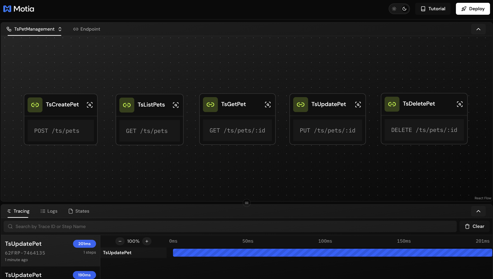

## What You'll Build

A pet management API with these endpoints:

- **POST `/pets`** - Create a new pet
- **GET `/pets`** - List all pets
- **GET `/pets/:id`** - Get a specific pet
- **PUT `/pets/:id`** - Update a pet
- **DELETE `/pets/:id`** - Delete a pet


---

## Getting Started

Clone the example repository:

```bash
git clone https://github.com/MotiaDev/build-your-first-app.git
cd build-your-first-app
git checkout api-endpoints
```

Install dependencies:

```bash
npm install
```

Start the Workbench:

```bash
npm run dev
```

Your Workbench will be available at `http://localhost:3000`.

---

## Project Structure

<Folder name="my-pet-api" defaultOpen>
  <Folder name="steps" defaultOpen>
    <Folder name="typescript">
      <File name="create-pet.step.ts" />
      <File name="get-pets.step.ts" />
      <File name="get-pet.step.ts" />
      <File name="update-pet.step.ts" />
      <File name="delete-pet.step.ts" />
      <File name="ts-store.ts" />
    </Folder>
    <Folder name="javascript">
      <File name="create-pet.step.js" />
      <File name="get-pets.step.js" />
      <File name="get-pet.step.js" />
      <File name="update-pet.step.js" />
      <File name="delete-pet.step.js" />
      <File name="js-store.js" />
    </Folder>
    <Folder name="python">
      <File name="create_pet_step.py" />
      <File name="get_pets_step.py" />
      <File name="get_pet_step.py" />
      <File name="update_pet_step.py" />
      <File name="delete_pet_step.py" />
    </Folder>
  </Folder>
    <Folder name="services">
      <File name="pet_store.py" />
      <File name="types.py" />
    </Folder>
  <File name="package.json" />
  <File name="requirements.txt" />
  <File name="types.d.ts" />
</Folder>

<Callout type="info">
Files like `features.json` and `tutorial.tsx` are only for the interactive tutorial and are not part of Motia's project structure.
</Callout>

All code examples in this guide are available in the [build-your-first-app](https://github.com/MotiaDev/build-your-first-app/tree/api-endpoints) repository.

You can follow this guide to learn how to build a REST API with Motia step by step, or you can clone the repository and dive into our Interactive Tutorial to learn by doing directly in the Workbench.


---

## Setting Up Data Storage

First, create a simple data store to persist pets.

<Callout type="info">
View the complete code on GitHub:
- [TypeScript Store](https://github.com/MotiaDev/build-your-first-app/blob/api-endpoints/steps/typescript/ts-store.ts)
- [Python Store](https://github.com/MotiaDev/build-your-first-app/blob/api-endpoints/services/pet_store.py)
- [JavaScript Store](https://github.com/MotiaDev/build-your-first-app/blob/api-endpoints/steps/javascript/js-store.js)
</Callout>

<Tabs items={['TypeScript', 'Python', 'JavaScript']}>
  <Tab value="TypeScript">
    ```typescript title="steps/typescript/ts-store.ts"
    import fs from 'node:fs'
    import path from 'node:path'

    export type Pet = {
      id: string
      name: string
      species: 'dog' | 'cat' | 'bird' | 'other'
      ageMonths: number
      status: 'available' | 'pending' | 'adopted'
      createdAt: number
      updatedAt: number
    }

    const DATA_DIR = path.join(process.cwd(), '.data')
    const FILE = path.join(DATA_DIR, 'pets.json')

    type DbShape = { seq: number; pets: Record<string, Pet> }

    function ensureFile(): void {
      if (!fs.existsSync(DATA_DIR)) fs.mkdirSync(DATA_DIR, { recursive: true })
      if (!fs.existsSync(FILE)) {
        fs.writeFileSync(FILE, JSON.stringify({ seq: 1, pets: {} }))
      }
    }

    function load(): DbShape {
      ensureFile()
      return JSON.parse(fs.readFileSync(FILE, 'utf8'))
    }

    function save(db: DbShape): void {
      fs.writeFileSync(FILE, JSON.stringify(db))
    }

    export const TSStore = {
      create(input: { name: string; species: Pet['species']; ageMonths: number }): Pet {
        const db = load()
        const id = String(db.seq++)
        const pet: Pet = {
          id,
          name: input.name.trim(),
          species: input.species,
          ageMonths: Math.max(0, Math.floor(input.ageMonths)),
          status: 'available',
          createdAt: Date.now(),
          updatedAt: Date.now(),
        }
        db.pets[id] = pet
        save(db)
        return pet
      },

      list(): Pet[] {
        const db = load()
        return Object.values(db.pets).sort((a, b) => b.updatedAt - a.updatedAt)
      },

      get(id: string): Pet | null {
        const db = load()
        return db.pets[id] ?? null
      },

      update(id: string, patch: Partial<Pet>): Pet | null {
        const db = load()
        const pet = db.pets[id]
        if (!pet) return null

        const updated = { ...pet, ...patch, updatedAt: Date.now() }
        db.pets[id] = updated
        save(db)
        return updated
      },

      remove(id: string): boolean {
        const db = load()
        if (!db.pets[id]) return false
        delete db.pets[id]
        save(db)
        return true
      },
    }
    ```
  </Tab>
  <Tab value="Python">
    ```python title="services/pet_store.py"
    import json
    import os
    import time
    from typing import Dict, Optional, List

    DATA_DIR = os.path.join(os.getcwd(), '.data')
    FILE = os.path.join(DATA_DIR, 'pets.json')

    def ensure_file():
        if not os.path.exists(DATA_DIR):
            os.makedirs(DATA_DIR, exist_ok=True)
        if not os.path.exists(FILE):
            with open(FILE, 'w') as f:
                json.dump({'seq': 1, 'pets': {}}, f)

    def load():
        ensure_file()
        with open(FILE, 'r') as f:
            return json.load(f)

    def save(db):
        with open(FILE, 'w') as f:
            json.dump(db, f)

    def create(name: str, species: str, ageMonths: int):
        db = load()
        pid = str(db['seq'])
        db['seq'] += 1
        pet = {
            'id': pid,
            'name': name.strip(),
            'species': species,
            'ageMonths': max(0, int(ageMonths)),
            'status': 'available',
            'createdAt': int(time.time() * 1000),
            'updatedAt': int(time.time() * 1000)
        }
        db['pets'][pid] = pet
        save(db)
        return pet

    def list_all():
        db = load()
        return sorted(db['pets'].values(), key=lambda p: p['updatedAt'], reverse=True)

    def get(pid: str):
        db = load()
        return db['pets'].get(pid)

    def update(pid: str, patch: Dict):
        db = load()
        pet = db['pets'].get(pid)
        if not pet:
            return None

        updated = {**pet, **patch, 'updatedAt': int(time.time() * 1000)}
        db['pets'][pid] = updated
        save(db)
        return updated

    def remove(pid: str):
        db = load()
        if pid not in db['pets']:
            return False
        del db['pets'][pid]
        save(db)
        return True
    ```
  </Tab>
  <Tab value="JavaScript">
    ```javascript title="steps/javascript/js-store.js"
    const fs = require('fs')
    const path = require('path')

    const DATA_DIR = path.join(process.cwd(), '.data')
    const FILE = path.join(DATA_DIR, 'pets.json')

    function ensureFile() {
      if (!fs.existsSync(DATA_DIR)) fs.mkdirSync(DATA_DIR, { recursive: true })
      if (!fs.existsSync(FILE)) {
        fs.writeFileSync(FILE, JSON.stringify({ seq: 1, pets: {} }))
      }
    }

    function load() {
      ensureFile()
      return JSON.parse(fs.readFileSync(FILE, 'utf8'))
    }

    function save(db) {
      fs.writeFileSync(FILE, JSON.stringify(db))
    }

    function create({ name, species, ageMonths }) {
      const db = load()
      const id = String(db.seq++)
      const pet = {
        id,
        name: name.trim(),
        species,
        ageMonths: Math.max(0, Math.floor(ageMonths)),
        status: 'available',
        createdAt: Date.now(),
        updatedAt: Date.now()
      }
      db.pets[id] = pet
      save(db)
      return pet
    }

    function list() {
      const db = load()
      return Object.values(db.pets).sort((a, b) => b.updatedAt - a.updatedAt)
    }

    function get(id) {
      const db = load()
      return db.pets[id] || null
    }

    function update(id, patch) {
      const db = load()
      const pet = db.pets[id]
      if (!pet) return null

      const updated = { ...pet, ...patch, updatedAt: Date.now() }
      db.pets[id] = updated
      save(db)
      return updated
    }

    function remove(id) {
      const db = load()
      if (!db.pets[id]) return false
      delete db.pets[id]
      save(db)
      return true
    }

    module.exports = { create, list, get, update, remove }
    ```
  </Tab>
</Tabs>

This store uses a JSON file for persistence. In production, you would use a database like PostgreSQL or MongoDB.

---

## Creating Your First Endpoint

## Configuration

Every API endpoint has two parts:

**Config** - Defines when and how the step runs:

| Property | Description |
|----------|-------------|
| `name` | Unique identifier |
| `type` | Set to `'api'` |
| `path` | URL path for the endpoint |
| `method` | HTTP method (GET, POST, PUT, DELETE) |

**Handler** - The function that executes your business logic.

<Callout type="info">
View on GitHub:
- [TypeScript](https://github.com/MotiaDev/build-your-first-app/blob/api-endpoints/steps/typescript/create-pet.step.ts)
- [Python](https://github.com/MotiaDev/build-your-first-app/blob/api-endpoints/steps/python/create_pet_step.py)
- [JavaScript](https://github.com/MotiaDev/build-your-first-app/blob/api-endpoints/steps/javascript/create-pet.step.js)
</Callout>

<Tabs items={['TypeScript', 'Python', 'JavaScript']}>
  <Tab value="TypeScript">
    ```typescript title="steps/typescript/create-pet.step.ts"
    import { ApiRouteConfig, Handlers } from 'motia'
    import { z } from 'zod'
    import { TSStore } from './ts-store'

const createPetSchema = z.object({
  name: z.string().min(1, 'Name is required'),
  species: z.enum(['dog', 'cat', 'bird', 'other']),
  ageMonths: z.number().int().min(0),
    })

export const config: ApiRouteConfig = {
      name: 'CreatePet',
  type: 'api',
  path: '/pets',
  method: 'POST',
  bodySchema: createPetSchema,
  flows: ['PetManagement'],
    }

export const handler: Handlers['CreatePet'] = async (req, { logger }) => {
      const data = createPetSchema.parse(req.body)
      const pet = TSStore.create(data)

      logger.info('Pet created', { petId: pet.id })

      return { status: 201, body: pet }
    }
    ```
  </Tab>
  <Tab value="Python">
    ```python title="steps/python/create_pet_step.py"
    import sys
    import os
    sys.path.insert(0, os.path.join(os.path.dirname(__file__), '..', '..'))
    from services import pet_store

    config = {
        "name": "CreatePet",
        "type": "api",
        "path": "/pets",
        "method": "POST",
        "emits": []
    }

    async def handler(req, ctx=None):
        b = req.get("body") or {}
        name = b.get("name")
        species = b.get("species")
        age = b.get("ageMonths")

        if not isinstance(name, str) or not name.strip():
            return {"status": 400, "body": {"message": "Invalid name"}}
        if species not in ["dog", "cat", "bird", "other"]:
            return {"status": 400, "body": {"message": "Invalid species"}}

        try:
            age_val = int(age)
        except Exception:
            return {"status": 400, "body": {"message": "Invalid ageMonths"}}

        pet = pet_store.create(name, species, age_val)
        return {"status": 201, "body": pet}
    ```
  </Tab>
  <Tab value="JavaScript">
    ```javascript title="steps/javascript/create-pet.step.js"
    const { create } = require('./js-store')

    const config = {
      name: 'CreatePet',
      type: 'api',
      path: '/pets',
      method: 'POST',
      emits: []
    }

    const handler = async (req) => {
      const b = req.body || {}
      const name = typeof b.name === 'string' && b.name.trim()
      const speciesOk = ['dog', 'cat', 'bird', 'other'].includes(b.species)
      const ageOk = Number.isFinite(b.ageMonths)

      if (!name || !speciesOk || !ageOk) {
        return { status: 400, body: { message: 'Invalid payload' } }
      }

      const pet = create({ name, species: b.species, ageMonths: Number(b.ageMonths) })
      return { status: 201, body: pet }
    }

    module.exports = { config, handler }
    ```
  </Tab>
</Tabs>

## Testing Your API

You can test your endpoint directly in the Workbench, Create Pets using the Create Pet endpoint:


The Workbench provides an interactive interface to test your API endpoints with real requests and see the responses in real-time.

---
## Adding GET Endpoints

### List All Pets

<Callout type="info">
View on GitHub:
- [TypeScript](https://github.com/MotiaDev/build-your-first-app/blob/api-endpoints/steps/typescript/get-pets.step.ts)
- [Python](https://github.com/MotiaDev/build-your-first-app/blob/api-endpoints/steps/python/get_pets_step.py)
- [JavaScript](https://github.com/MotiaDev/build-your-first-app/blob/api-endpoints/steps/javascript/get-pets.step.js)
</Callout>

<Tabs items={['TypeScript', 'Python', 'JavaScript']}>
  <Tab value="TypeScript">
    ```typescript title="steps/typescript/get-pets.step.ts"
    import { ApiRouteConfig, Handlers } from 'motia'
    import { TSStore } from './ts-store'

export const config: ApiRouteConfig = {
      name: 'GetPets',
  type: 'api',
  path: '/pets',
  method: 'GET',
  flows: ['PetManagement'],
    }

export const handler: Handlers['GetPets'] = async (req, { logger }) => {
      const pets = TSStore.list()
      logger.info('Retrieved all pets', { count: pets.length })
      return { status: 200, body: pets }
    }
    ```
  </Tab>
  <Tab value="Python">
    ```python title="steps/python/get_pets_step.py"
    import sys
    import os
    sys.path.insert(0, os.path.join(os.path.dirname(__file__), '..', '..'))
    from services import pet_store

    config = {
        "name": "GetPets",
        "type": "api",
        "path": "/pets",
        "method": "GET",
        "emits": []
    }

    async def handler(req, ctx=None):
        return {"status": 200, "body": pet_store.list_all()}
    ```
  </Tab>
  <Tab value="JavaScript">
    ```javascript title="steps/javascript/get-pets.step.js"
    const { list } = require('./js-store')

    const config = {
      name: 'GetPets',
      type: 'api',
      path: '/pets',
      method: 'GET',
      emits: []
    }

    const handler = async () => {
      return { status: 200, body: list() }
    }

    module.exports = { config, handler }
    ```
  </Tab>
</Tabs>

## List All Pets

You can test your endpoint directly in the Workbench, List all Pets using the  `List All Pets` endpoint:


---

### Get Single Pet

<Callout type="info">
View on GitHub:
- [TypeScript](https://github.com/MotiaDev/build-your-first-app/blob/api-endpoints/steps/typescript/get-pet.step.ts)
- [Python](https://github.com/MotiaDev/build-your-first-app/blob/api-endpoints/steps/python/get_pet_step.py)
- [JavaScript](https://github.com/MotiaDev/build-your-first-app/blob/api-endpoints/steps/javascript/get-pet.step.js)
</Callout>

<Tabs items={['TypeScript', 'Python', 'JavaScript']}>
  <Tab value="TypeScript">
    ```typescript title="steps/typescript/get-pet.step.ts"
    import { ApiRouteConfig, Handlers } from 'motia'
    import { TSStore } from './ts-store'

export const config: ApiRouteConfig = {
      name: 'GetPet',
  type: 'api',
  path: '/pets/:id',
  method: 'GET',
  flows: ['PetManagement'],
    }

export const handler: Handlers['GetPet'] = async (req, { logger }) => {
      const pet = TSStore.get(req.pathParams.id)

  if (!pet) {
        logger.warn('Pet not found', { id: req.pathParams.id })
        return { status: 404, body: { message: 'Pet not found' } }
      }

      return { status: 200, body: pet }
    }
    ```
  </Tab>
  <Tab value="Python">
    ```python title="steps/python/get_pet_step.py"
    import sys
    import os
    sys.path.insert(0, os.path.join(os.path.dirname(__file__), '..', '..'))
    from services import pet_store

    config = {
        "name": "GetPet",
        "type": "api",
        "path": "/pets/:id",
        "method": "GET",
        "emits": []
    }

    async def handler(req, ctx=None):
        pid = req.get("pathParams", {}).get("id")
        pet = pet_store.get(pid)
        return {"status": 200, "body": pet} if pet else {"status": 404, "body": {"message": "Not found"}}
    ```
  </Tab>
  <Tab value="JavaScript">
    ```javascript title="steps/javascript/get-pet.step.js"
    const { get } = require('./js-store')

    const config = {
      name: 'GetPet',
      type: 'api',
      path: '/pets/:id',
      method: 'GET',
      emits: []
    }

    const handler = async (req) => {
      const pet = get(req.pathParams.id)
      return pet 
        ? { status: 200, body: pet } 
        : { status: 404, body: { message: 'Not found' } }
    }

    module.exports = { config, handler }
    ```
  </Tab>
</Tabs>

<Callout type="info">
**Testing tip:** When testing GET endpoints with path parameters like `/pets/:id`, switch to the **Params** tab (not Body) to enter the ID value.
</Callout>

The `:id` in the path creates a path parameter accessible via `req.pathParams.id`.

You can test your endpoint directly in the Workbench, Get Single Pet using the `Get Single Pet` endpoint:


---

## Adding UPDATE Endpoint

<Callout type="info">
View on GitHub:
- [TypeScript](https://github.com/MotiaDev/build-your-first-app/blob/api-endpoints/steps/typescript/update-pet.step.ts)
- [Python](https://github.com/MotiaDev/build-your-first-app/blob/api-endpoints/steps/python/update_pet_step.py)
- [JavaScript](https://github.com/MotiaDev/build-your-first-app/blob/api-endpoints/steps/javascript/update-pet.step.js)
</Callout>

<Tabs items={['TypeScript', 'Python', 'JavaScript']}>
  <Tab value="TypeScript">
    ```typescript title="steps/typescript/update-pet.step.ts"
    import { ApiRouteConfig, Handlers } from 'motia'
    import { z } from 'zod'
    import { TSStore } from './ts-store'

const updatePetSchema = z.object({
  name: z.string().min(1).optional(),
      status: z.enum(['available', 'pending', 'adopted']).optional(),
  ageMonths: z.number().int().min(0).optional(),
    })

export const config: ApiRouteConfig = {
      name: 'UpdatePet',
  type: 'api',
  path: '/pets/:id',
  method: 'PUT',
  bodySchema: updatePetSchema,
  flows: ['PetManagement'],
    }

export const handler: Handlers['UpdatePet'] = async (req, { logger }) => {
      const updates = updatePetSchema.parse(req.body)
      const pet = TSStore.update(req.pathParams.id, updates)

  if (!pet) {
        return { status: 404, body: { message: 'Pet not found' } }
      }

      logger.info('Pet updated', { petId: pet.id })
      return { status: 200, body: pet }
    }
    ```
  </Tab>
  <Tab value="Python">
    ```python title="steps/python/update_pet_step.py"
    import sys
    import os
    sys.path.insert(0, os.path.join(os.path.dirname(__file__), '..', '..'))
    from services import pet_store

    config = {
        "name": "UpdatePet",
        "type": "api",
        "path": "/pets/:id",
        "method": "PUT",
        "emits": []
    }

    async def handler(req, ctx=None):
        pid = req.get("pathParams", {}).get("id")
        b = req.get("body") or {}
        patch = {}

        if isinstance(b.get("name"), str):
            patch["name"] = b["name"]
        if b.get("species") in ["dog", "cat", "bird", "other"]:
            patch["species"] = b["species"]
        if isinstance(b.get("ageMonths"), (int, float)):
            patch["ageMonths"] = int(b["ageMonths"])
        if b.get("status") in ["available", "pending", "adopted"]:
            patch["status"] = b["status"]

        updated = pet_store.update(pid, patch)
        return {"status": 200, "body": updated} if updated else {"status": 404, "body": {"message": "Not found"}}
    ```
  </Tab>
  <Tab value="JavaScript">
    ```javascript title="steps/javascript/update-pet.step.js"
    const { update } = require('./js-store')

    const config = {
      name: 'UpdatePet',
      type: 'api',
      path: '/pets/:id',
      method: 'PUT',
      emits: []
    }

    const handler = async (req) => {
      const b = req.body || {}
      const patch = {}

      if (typeof b.name === 'string') patch.name = b.name
      if (['dog', 'cat', 'bird', 'other'].includes(b.species)) patch.species = b.species
      if (Number.isFinite(b.ageMonths)) patch.ageMonths = Number(b.ageMonths)
      if (['available', 'pending', 'adopted'].includes(b.status)) patch.status = b.status

      const updated = update(req.pathParams.id, patch)
      return updated 
        ? { status: 200, body: updated } 
        : { status: 404, body: { message: 'Not found' } }
    }

    module.exports = { config, handler }
    ```
  </Tab>
</Tabs>

You can test your endpoint directly in the Workbench, Update Pet using the `Update Pet` endpoint:


---

## Adding DELETE Endpoint

<Callout type="info">
View on GitHub:
- [TypeScript](https://github.com/MotiaDev/build-your-first-app/blob/api-endpoints/steps/typescript/delete-pet.step.ts)
- [Python](https://github.com/MotiaDev/build-your-first-app/blob/api-endpoints/steps/python/delete_pet_step.py)
- [JavaScript](https://github.com/MotiaDev/build-your-first-app/blob/api-endpoints/steps/javascript/delete-pet.step.js)
</Callout>

<Tabs items={['TypeScript', 'Python', 'JavaScript']}>
  <Tab value="TypeScript">
    ```typescript title="steps/typescript/delete-pet.step.ts"
    import { ApiRouteConfig, Handlers } from 'motia'
    import { TSStore } from './ts-store'

export const config: ApiRouteConfig = {
      name: 'DeletePet',
  type: 'api',
  path: '/pets/:id',
  method: 'DELETE',
  flows: ['PetManagement'],
    }

export const handler: Handlers['DeletePet'] = async (req, { logger }) => {
      const deleted = TSStore.remove(req.pathParams.id)

  if (!deleted) {
        return { status: 404, body: { message: 'Pet not found' } }
      }

      logger.info('Pet deleted', { petId: req.pathParams.id })
      return { status: 204 }
    }
    ```
  </Tab>
  <Tab value="Python">
    ```python title="steps/python/delete_pet_step.py"
    import sys
    import os
    sys.path.insert(0, os.path.join(os.path.dirname(__file__), '..', '..'))
    from services import pet_store

    config = {
        "name": "DeletePet",
        "type": "api",
        "path": "/pets/:id",
        "method": "DELETE",
        "emits": []
    }

    async def handler(req, ctx=None):
        pid = req.get("pathParams", {}).get("id")
        ok = pet_store.remove(pid)
        return {"status": 204, "body": {}} if ok else {"status": 404, "body": {"message": "Not found"}}
    ```
  </Tab>
  <Tab value="JavaScript">
    ```javascript title="steps/javascript/delete-pet.step.js"
    const { remove } = require('./js-store')

    const config = {
      name: 'DeletePet',
      type: 'api',
      path: '/pets/:id',
      method: 'DELETE',
      emits: []
    }

    const handler = async (req) => {
      const ok = remove(req.pathParams.id)
      return ok 
        ? { status: 204, body: {} } 
        : { status: 404, body: { message: 'Not found' } }
    }

    module.exports = { config, handler }
    ```
  </Tab>
</Tabs>

DELETE endpoints return `204 No Content` on success.

You can test your endpoint directly in the Workbench, Delete Pet using the `Delete Pet` endpoint:


As you can see in this example, Motia handles routing, validation, and error handling automatically. With just a few lines of code, you've built a complete REST API with:
- **Automatic routing** based on your step configuration
- **Path parameter extraction** (`/pets/:id` → `req.pathParams.id`)
- **HTTP method handling** (GET, POST, PUT, DELETE)
- **Response formatting** with proper status codes
- **Built-in error handling** and validation

🎉 **Congratulations!** You've successfully created your first API endpoints with Motia. Your pet store API is now ready to handle all CRUD operations.

---

## What's Next?

You now have a working REST API for your pet store! But a complete backend system needs more than just API endpoints. In the next guide, we'll add background jobs using Event Steps and scheduled tasks with Cron Steps to handle tasks like:

- **SetNextFeedingReminder** - Queue jobs that automatically schedule feeding reminders when pets are added or updated
- **Deletion Reaper** - Cron jobs that run daily to clean up soft-deleted records and expired data

Let's continue building your complete backend system by adding these background jobs with Event Steps and scheduled tasks with Cron Steps.

<Cards>
  <Card href="/docs/concepts/steps" title="Steps">
    Learn more about Steps and triggers
  </Card>

</Cards>
