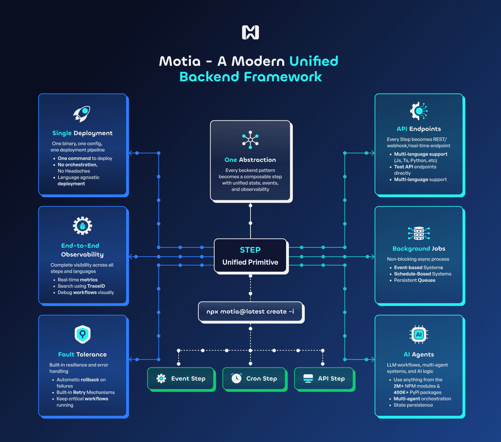
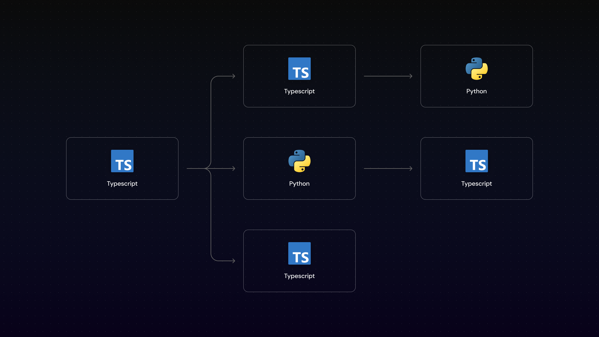
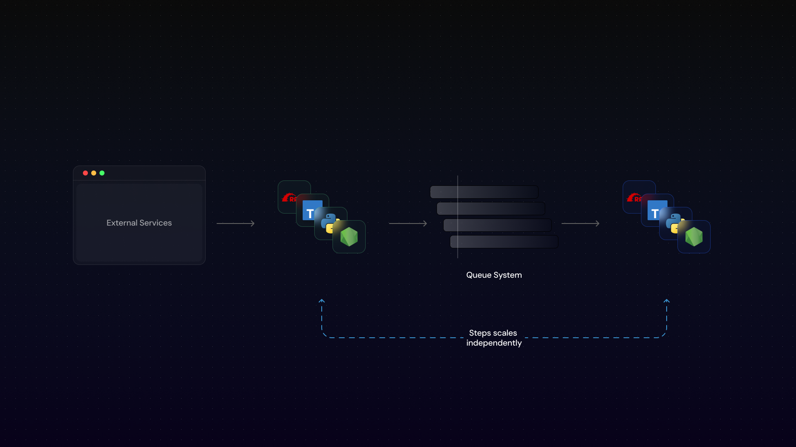
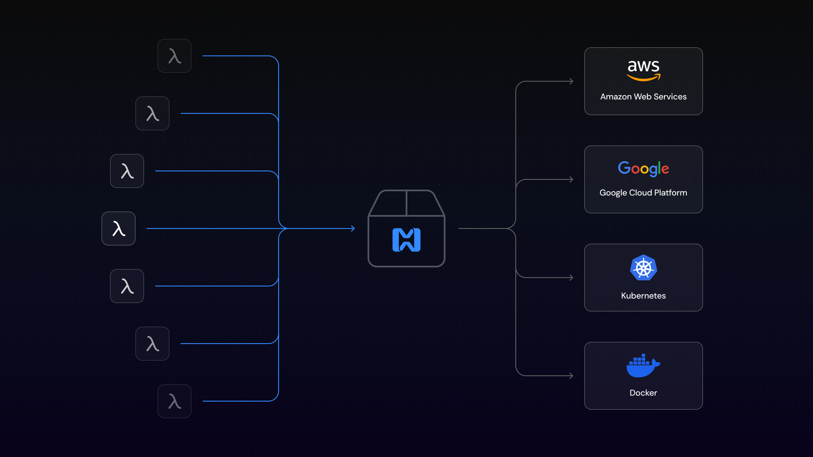
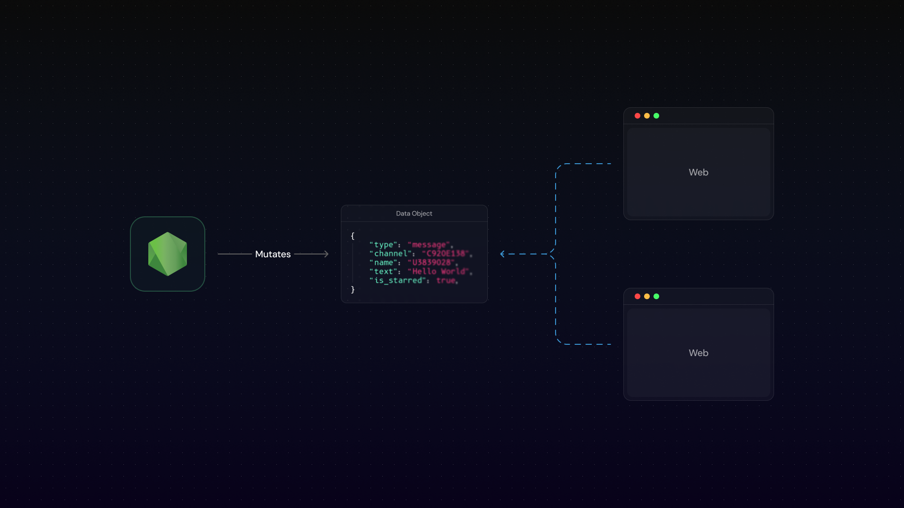

## Why use Motia

Today, backend engineers and software architects face several recurring problems. Motia was created to simplify these common backend engineering challenges in a flexible and elegant way to provide world class developer experience while ensuring robust, event-driven infrastructure.

- Unified vs. Fragmented backend
  - Working with multiple Languages
- Scalability
- Observability
- Fault tolerance
- Building and shipping
  - Rollbacks and deployment strategies
- Real-time data streaming

## How Motia simplifies all of this?

Similar to how React simplified frontend development where everything is a component, Motia simplifies backend development where everything is a **Step**. In Motia, every backend pattern becomes a group of composable steps with unified state, events and observability. In this way, engineers only have to learn a few concepts about how a Motia Step works, and they get an enterprise-grade event-driven system out of the box.

## How Simple is a Step?

Every Step has exactly **4 elements** and comes in **3 types**:

### 4 Elements (Master these, build anything)
1. **Trigger** - Define how your Step gets initiated - through an API request, event subscription, or scheduled task.
2. **Subscribe** - Specify what data structure your Step expects to receive.  
3. **Handler** - The core function that processes data and performs your business logic.
4. **Emit** - Define what events your Step can emit. These events can be subscribed to by other Steps.

### 3 Step Types (Cover every backend need)
- **API** - API endpoints for client requests
- **Event** - Async processing triggered by other Steps  
- **Cron** - Scheduled tasks that run on timers

### Multi-Language by Design

Write each Step in the best language for the job - all working together in one unified system:

<Tabs items={['TypeScript', 'Python', 'JavaScript']}>

<Tab value="TypeScript">
```typescript
// steps/api/analyze-data.step.ts - TypeScript for APIs
import { ApiRouteConfig, Handlers } from 'motia'

export const config: ApiRouteConfig = {
  name: 'AnalyzeData',
  type: 'api',                    // ← TRIGGER: API endpoint
  method: 'POST',
  path: '/analyze',
  emits: ['data.received'],       // ← EMIT: Triggers Python step
  flows: ['ai-pipeline']
}

export const handler: Handlers['AnalyzeData'] = async (req, { emit }) => {
  const { dataset } = req.body    // ← SUBSCRIBE: Get request data
  
  // ← HANDLER: Validate and prepare data
  const processedData = { dataset, timestamp: new Date().toISOString() }
  
  // ← EMIT: Send to AI processing step (Python)
  await emit({ topic: 'data.received', data: processedData })
  return { status: 200, body: { message: 'Analysis started' } }
}
```
</Tab>

<Tab value="Python">
```python
# steps/events/ai_analysis_step.py - Python for AI processing
config = {
    "name": "AIAnalysis",
    "type": "event",               # ← TRIGGER: Event-driven
    "subscribes": ["data.received"], # ← TRIGGER: Listen to TypeScript step
    "emits": ["analysis.completed"], # ← EMIT: Triggers JavaScript step
    "flows": ["ai-pipeline"]
}

async def handler(input_data, context):
    dataset = input_data.get("dataset")  # ← SUBSCRIBE: Get data from TypeScript
    
    # ← HANDLER: AI/ML processing with Python libraries
    analysis_result = {
        "dataset": dataset,
        "insights": ["Pattern A detected", "Anomaly at point B"],
        "confidence": 0.95,
        "completed_at": context.utils.dates.now().isoformat()
    }
    
    # ← EMIT: Send results to notification step (JavaScript)
    await context.emit({
        "topic": "analysis.completed",
        "data": analysis_result
    })
```
</Tab>

<Tab value="JavaScript">
```javascript
// steps/events/send-notification.step.js - JavaScript for notifications
exports.config = {
  name: 'SendNotification',
  type: 'event',                  // ← TRIGGER: Event-driven
  subscribes: ['analysis.completed'], // ← TRIGGER: Listen to Python step
  emits: ['notification.sent'],   // ← EMIT: Final step
  flows: ['notification-pipeline']
}

exports.handler = async (input, { emit, logger }) => {
  const { insights, confidence } = input  // ← SUBSCRIBE: Get AI results from Python
  
  // ← HANDLER: Send notifications using JavaScript libraries
  const notification = {
    message: `Analysis complete! Found ${insights.length} insights with ${confidence * 100}% confidence`,
    channels: ['email', 'slack'],
    sent_at: new Date().toISOString()
  }
  
  logger.info('Notification sent', notification)
  
  // ← EMIT: Mark workflow complete
  await emit({ topic: 'notification.sent', data: notification })
}
```
</Tab>

</Tabs>

### Steps are Composable

Chain Steps together to build complex workflows:


Each language does what it does best, sharing state and events across the entire workflow.

### The Power of Steps

- **Simple**: Master 4 elements, build anything
- **Composable**: Chain any Step with any other Step
- **Multi-language**: TypeScript, JavaScript, Python work together
- **Event-driven**: Built for modern async, real-time applications
- **Scalable**: Each Step scales independently
- **Reusable**: Share Steps across projects and teams

From simple APIs to complex AI workflows, from real-time chat to scheduled data processing - it's all just Steps connecting through events.



## Unified vs. Fragmented backend

Modern software engineering is splintered. APIs live in one framework, background jobs in another, queues have their own tooling, and AI agents are springing up in yet more isolated runtimes. Motia exists to unify all of these concerns API endpoints, automations & workflows, background tasks, queues, and AI agents into a single, coherent system with shared observability and developer experience.

To read more about this, check out our [manifesto](/manifesto).

### Working with multiple Languages

The rapid advancement of AI has reshaped the software industry—many cutting-edge AI tools are available only in specific programming languages, this forces companies to decide if they either change their team's skillset to a different language or not leveraging these technologies at all.

Motia removes this limitation by allowing each Step to be written in any language, while still sharing a common state.



_Each rectangle in the diagram above represents a Step, some of them are in TypeScript and others in Python._

## Scalability

One of the biggest dilemmas in backend development is choosing between scalability and development velocity. In startup environments, speed often takes priority, resulting in systems that don't scale well and become problematic under increased load.

Motia addresses scalability by leveraging the core primitive of **Steps**: Each step can scale independently avoiding the bottlenecks common in monolithic architectures.



## Observability

Observability in traditional backends often demands significant engineering effort to implement logging, alerting, and tracing. Typically, these tools are only configured for cloud environments, local development is generally neglected—leading to low productivity and poor dev experience.

Motia offers a complete observability toolkit available in both cloud and local environments, including:

- Logs visualization
- Tracing tool to quickly visualize the flow of requests through the system
- State visualization
- Diagram representation of dependencies between steps and how they are connected

_The image below shows the Workbench interface available when you run `motia dev`. On the top panel you can see a workflow diagram with multiple steps connected.
On the bottom panel you can see the trace view of a single request and what happened in each step._


## Fault tolerance

With the rise of AI, many backend tasks have become less deterministic and more error-prone. These scenarios require robust error handling and retry mechanisms. In traditional systems, developers often need to set up and maintain queue infrastructures to ensure resilience, especially when dealing with unreliable responses from LLMs.

Motia provides fault tolerance out of the box, eliminating the need to manually spin up queue infrastructure.

- Using Event Steps, you get retry mechanisms out of the box
- Configuration of queue infrastructure is abstracted away

## Building and Shipping

Building and deploying backends is inherently complex—especially in polyglot environments. Shipping production systems requires tight collaboration between developers and operations, and automation often takes weeks to get right.

Beyond that, cloud provider lock-in, complicated deployment strategies (e.g., rollbacks, blue/green deployments), and a lack of deployment tooling increase the risk of failure.

Motia abstracts these concerns by providing:

- True cloud-provider agnosticism
- Atomic blue/green deployments and one-click rollbacks via Motia Cloud (canary support coming soon)
- First-class polyglot backend support (currently Node.js and Python, with more on the way)



_The image above shows several Steps being build to a single Motia deployable that are ultimately deployed to a cloud provider of your choice. 
Currently we're supporting AWS and Kubernetes, more Cloud providers coming soon. Check our [roadmap](https://github.com/orgs/MotiaDev/projects/2/views/4?filterQuery=title%3A+BYOC) for more details._

### Rollbacks and deployment strategies

Deploying cloud-native, fault-tolerant applications often involves modifying queue systems and other infrastructure components. 
These changes can introduce incompatibilities and lead to runtime failures.

Motia Cloud solves this with **Atomic Deployments**, which:

- Each deployment spins up a new isolated service that shares the same data layer
- Ensures safe, rollback-capable deployments without risking service downtime
- Instant rollbacks with one click since each deployment is isolated

## Real-time data streaming

Handling real-time data is one of the most common—and complex—challenges in backend development. It's necessary when building event-driven applications, 
and it typically requires setting up and maintaining a significant amount of infrastructure.

Motia provides what we call _Streams_: Developers define the structure of the data—any changes to these objects are streamed to all subscribed clients in real-time.



_The image above shows a Stream definition, a Node.js Step mutating the data and a client subscribing to the stream receiving real-time updates._